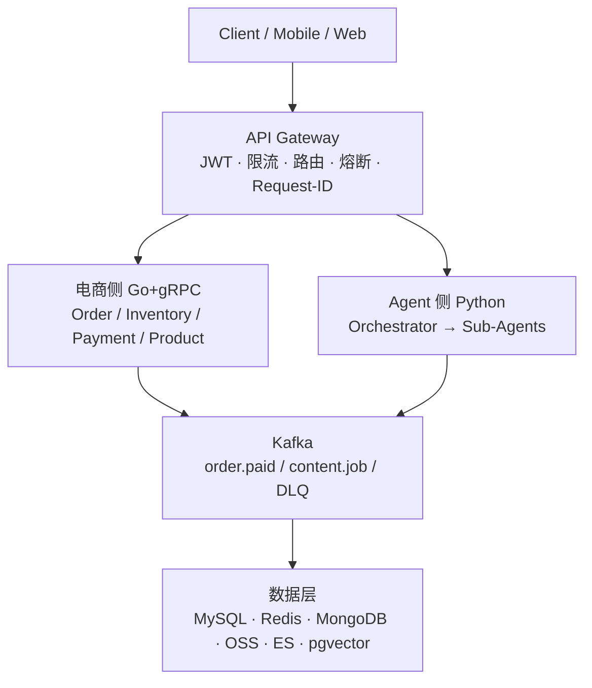
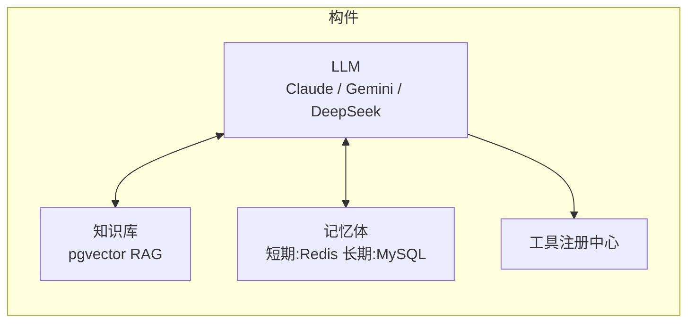
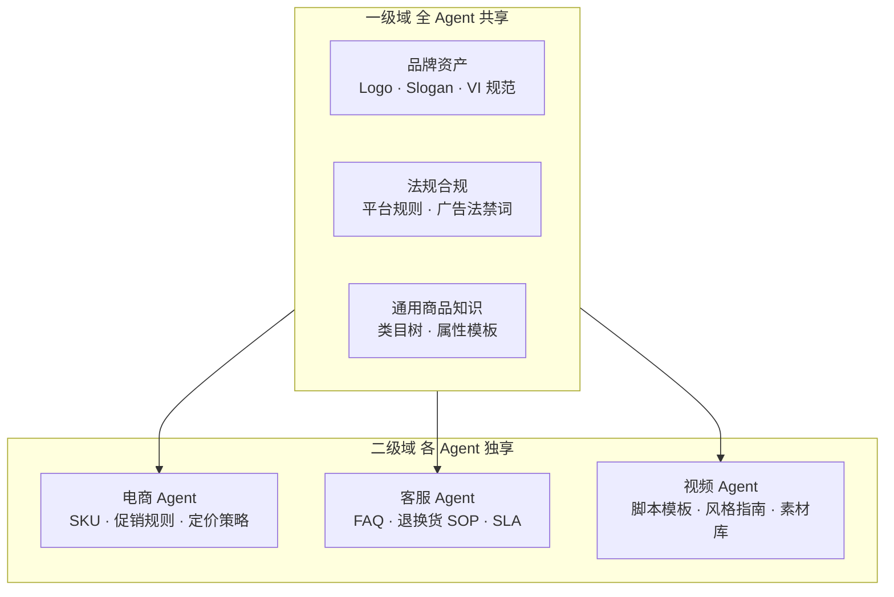
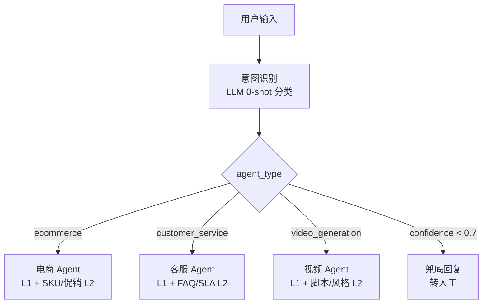
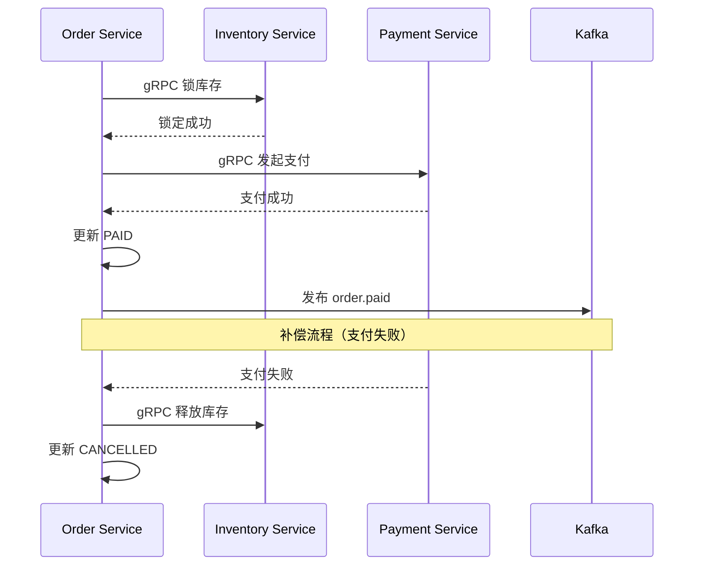

# 像素阶跃 AIGC 电商平台 — 系统设计文档

> 电商网站: **[https://pixel.agentdna.store](https://pixel.agentdna.store)**

> 完整交互式文档：**[pixel.docs.agentdna.store](https://pixel.docs.agentdna.store)**

---

## 目录

1. [系统概述](#1-系统概述)
2. [本期范围边界](#2-本期范围边界)
3. [系统架构设计](#3-系统架构设计)
   - 3.1 微服务划分（13 个服务）
   - 3.2 服务间通信与 Request-ID
   - 3.3 API 接口设计规范
   - 3.4 整体架构图
4. [Agent 设计](#4-agent-设计)
   - 4.1 Agent 核心构件
   - 4.2 知识库分域设计
   - 4.3 意图识别与路由
   - 4.4 完整任务流程
   - 4.5 工程落地设计
5. [分布式事务与一致性](#5-分布式事务与一致性)
   - 4.1 方案选型
   - 4.2 库存超卖防护
   - 4.3 幂等与补偿
6. [数据与性能优化](#6-数据与性能优化)
   - 6.1 多模态存储选型
   - 6.2 核心表结构设计
   - 6.3 数据流设计
   - 6.4 高并发性能优化
7. [可观测性](#7-可观测性)
8. [技术选型总览](#8-技术选型总览)
9. [附录：架构决策记录（ADR）](#附录架构决策记录adr)

---

## 1. 系统概述

公司构建一个 **AI 电商内容生成平台**，系统需要同时满足两条业务主线：

| 主线 | 特征 | 核心挑战 |
| --- | --- | --- |
| **电商交易** | 下单 / 支付 / 产品 / 库存 | 高并发、强一致、低延迟 |
| **AIGC 内容生成** | AI 商品视频 / 图片 / 文案 | 长耗时、异步工作流、多模态 |

### 设计原则

- **高内聚低耦合**：按业务域划分微服务，数据库不跨服务共享
- **异步优先**：AIGC 生成链路全异步，不阻塞交易主链路
- **最终一致**：分布式事务采用 Saga 模式，接受短暂不一致
- **防御性设计**：幂等、熔断、限流、补偿兜底

---

## 2. 本期范围边界

| 类别 | 包含（Phase 1） | 二期规划 |
| --- | --- | --- |
| 电商 | 下单 / 支付 / 库存核心链路 | 秒杀 / 拼团 / 营销活动引擎 |
| AIGC | 视频 / 图片 / 文案生成 | 自研视频模型训练 |
| Agent | 意图识别 / ReAct / 工具调用 | 内容 A/B 实验平台 |
| 架构 | 单租户 SaaS | 多租户 / 多品牌隔离 |
| 国际化 | 中文，人民币结算 | 多语言 / 多货币 |

---

## 3. 系统架构设计

### 3.1 微服务划分

系统按**业务域**（Domain）切分，共 **13 个微服务**，分为两条业务线：

**电商交易侧（Go + gRPC）**

| 服务 | 职责 | 核心实体 |
| --- | --- | --- |
| **Order Service** | 订单创建、状态机流转、幂等控制 | Order, OrderItem |
| **Inventory Service** | 库存查询、预占、扣减、释放 | Inventory, InventoryLock |
| **Payment Service** | 支付渠道适配、支付回调、退款 | Payment, Refund |
| **User Service** | 账户管理、RBAC 权限、会员权益 | User, Role, Permission |
| **Product Service** | 商品信息、SKU 管理、价格策略 | Product, SKU, Price |
| **Notification Service** | 消息推送（短信 / 邮件 / 站内信） | Notification |

**AIGC 内容侧（Python + LangChain + LangSmith）**

| 服务 | 职责 | 核心实体 |
| --- | --- | --- |
| **Agent Orchestrator** | 意图解析、任务编排、ReAct 循环 | Session, Task, Trace |
| **Workflow Service** | AIGC 任务全生命周期状态管理与重试调度 | WorkflowTask, StepLog |
| **Content Generator** | 视频 / 图片 / 文案生成流水线 | ContentJob, MediaAsset |
| **Media Service** | 媒体转码、缩略图、水印、CDN 分发 | MediaJob, Thumbnail |
| **Prompt Service** | Prompt 模板版本管理、A/B 实验 | PromptTemplate, Experiment |
| **Task Service** | 异步任务队列封装（Bull Queue）、优先级调度 | Job, RetryPolicy |
| **LLM Gateway** | 统一 LLM 接入、模型路由、Token 计量 | LLMRequest, Usage |

### 3.2 服务间通信与 Request-ID

**通信矩阵**

| 调用方 | 被调方 | 协议 | 理由 |
| --- | --- | --- | --- |
| 客户端 → API Gateway | — | REST/HTTPS | 对外标准协议，兼容性最好 |
| API Gateway → 各 Service | — | gRPC | 内网低延迟，强类型，支持流式 |
| Order → Inventory | — | gRPC（同步） | 锁库存需要即时结果 |
| Order → Payment | — | gRPC（同步） | 发起支付需要同步拿到支付链接 |
| Payment → Kafka | — | 事务消息 | 支付完成异步通知，不阻塞支付回调 |
| Kafka → Agent | — | 异步消费 | 内容生成耗时长，必须异步解耦 |

**Request-ID 全链路传播**

API Gateway 在入口为每个请求生成全局唯一 `X-Request-ID: <uuid-v4>`，并注入所有下游调用：

```
Client
  │  POST /orders
  ▼
API Gateway ── 生成 X-Request-ID: req-xxxx ──▶ gRPC metadata: request-id=req-xxxx ──▶ Order Service
                                                                                              │ gRPC metadata: request-id=req-xxxx
                                                                                              ▼
                                                                                    Inventory Service
                                                                                              │ Kafka header: request-id=req-xxxx
                                                                                              ▼
                                                                                         Kafka Topic
```

- gRPC 调用：注入 `metadata["request-id"]`
- Kafka 消息：注入 `header["request-id"]`
- 所有服务结构化日志必须包含 `request_id` 字段
- Jaeger `trace_id` 与 `request_id` 双字段并存：TraceId 用于性能分析，Request-ID 用于业务排查

**API Gateway 职责**

- JWT 签名验证（RS256）
- 令牌桶限流（per user / per IP）
- 路由转发（path → service）
- 熔断降级（Sentinel）
- 服务发现（Consul DNS：`order-service.service.consul`）
- Request-ID 生成与注入

### 3.3 API 接口设计规范

所有接口以 `/api/v1/` 为前缀，详见完整文档 [API 接口设计规范](https://pixel.docs.agentdna.store/architecture/api-design)。

**核心接口清单**

| 方法 | 路径 | 说明 |
| --- | --- | --- |
| POST | `/api/v1/order/create` | 创建订单，触发 Saga 事务 |
| POST | `/api/v1/payment/pay` | 发起支付，返回支付链接 |
| GET  | `/api/v1/order/{orderId}` | 查询订单详情 |
| GET  | `/api/v1/inventory/query` | 查询 SKU 实时库存 |
| POST | `/api/v1/generate/video` | 提交视频生成任务（异步） |
| POST | `/api/v1/generate/image` | 生成商品场景图（同步） |
| POST | `/api/v1/generate/copy`  | 生成商品文案（同步） |
| GET  | `/api/v1/generate/tasks/{taskId}/stream` | SSE 实时进度推送 |
| POST | `/api/v1/agent/chat` | Agent 多轮对话入口 |

### 3.4 整体架构图



---

## 4. Agent 设计

### 4.1 Agent 核心构件

每个 Agent 由四个核心构件组成：



### 4.2 知识库分域设计

知识库按功能角色分为两级域，实现共享与隔离的平衡：



- **L1（一级域）**：全 Agent 共享，包含品牌资产、法规合规、通用商品知识
- **L2（二级域）**：各 Agent 独享，按业务角色隔离，避免知识库污染

### 4.3 意图识别与路由

Orchestrator 用 LLM 对用户输入做 0-shot 分类，输出 `{agent_type, confidence, domain_level}`，路由到对应 Agent 并加载 L1 + 对应 L2 知识上下文：



### 4.4 完整任务流程

系统采用 **ReAct（Reasoning + Acting）** 框架，Orchestrator 负责推理与任务分发，Sub-Agent 负责具体生成任务。

**示例**：用户输入「帮我生成一个展示红色连衣裙的短视频」

```
Step 1 │ Thought: 需要先获取商品信息
        │ Action:  product_search({name: "红色连衣裙", color: "红色"})
        │ Obs:     [{id:"P001", imageUrl:"oss://...", name:"玫瑰红连衣裙", price:299}]

Step 2 │ Thought: 检查库存是否充足
        │ Action:  inventory_query({productId: "P001"})
        │ Obs:     {available: 23}

Step 3 │ Thought: 生成视频脚本
        │ Action:  llm_generate_script({product: "玫瑰红连衣裙", scene: "展示"})
        │ Obs:     "春日限定，这条红裙让你成为最亮的那道光..."

Step 4 │ Thought: 并行生成视频、配音、字幕
        │ Action:  [并行 DAG]
        │          ├── image_agent:  生成场景图（SD/ComfyUI）
        │          ├── video_agent:  生成视频片段（文生视频 API）
        │          └── copy_agent:   TTS 生成配音 + 字幕文件
        │ Obs:     {imageUrl, videoUrl, audioUrl, subtitleUrl}

Step 5 │ Thought: 合成最终视频
        │ Action:  video_synthesize({...上步结果})
        │ Obs:     {finalUrl: "oss://content/v001.mp4", duration: 30}

Result │ 返回用户："您的视频已生成完成，点击查看 →"
```

**Tool 定义规范（JSON Schema）**

```json
{
  "name": "video_generate",
  "description": "根据商品图片和脚本生成营销短视频，返回 jobId（异步）",
  "parameters": {
    "type": "object",
    "properties": {
      "product_image_url": { "type": "string" },
      "script": { "type": "string", "maxLength": 200 },
      "duration_seconds": { "type": "number", "enum": [15, 30, 60] }
    },
    "required": ["product_image_url", "script"]
  }
}
```

### 4.5 工程落地设计

**异步化与进度推送**

视频生成是耗时任务（30s ~ 3min），必须全异步：

```
POST /agent/tasks
  └── 立即返回 { taskId: "T123", status: "PENDING" }

GET /agent/tasks/T123/progress  (SSE 长连接)
  └── 实时推送:
      data: {"step": 1, "progress": 20, "message": "正在获取商品信息"}
      data: {"step": 4, "progress": 70, "message": "视频生成中..."}
      data: {"step": 5, "progress": 100, "videoUrl": "oss://..."}
```

**防无限循环**

```python
MAX_STEPS = 8  # 最大推理步数

for step in range(MAX_STEPS):
    action = llm.think(context)
    if action.type == "finish":
        break
    # 检测循环：连续 2 步相同 tool + args
    if is_loop_detected(history[-2:], action):
        return fallback_response()
    result = tool_registry.execute(action)
    context.append(result)
else:
    return partial_result_response()  # 超步数返回中间结果
```

**内容去重复用**

缓存 key：`content:dedup:{sha256(productId+style+duration)}`，TTL 7 天。相同参数命中缓存直接返回已生成视频 URL，预计降低成本约 30%。

**Agent 可观测性（LangSmith）**

通过 LangSmith 统一追踪每次 Agent 执行链路，记录 Prompt、Tool 调用、Latency、Token 成本与失败重试轨迹：

- Trace 维度：`request_id`、`session_id`、`workflow_task_id`
- 评估维度：成功率、平均步数、工具调用成功率、单任务成本
- 线上回放：按 `request_id` 一键定位失败步骤与输入输出快照

---

## 5. 分布式事务与一致性

### 5.1 方案选型

**为什么不用 2PC**

| 问题 | 说明 |
| --- | --- |
| 性能差 | 两阶段锁定期间所有参与者资源被占用 |
| 协调者单点 | 协调者宕机导致所有参与者无限等待 |
| 不适合微服务 | 跨网络的分布式锁会放大网络延迟 |

**选用 Saga 模式（编排式）**

Order Service 作为 Saga 协调者，按序调用各步骤，任意步骤失败时执行逆向补偿：



**事务消息（Outbox Pattern）**

保证 DB 写入与 Kafka 发布的原子性：

```sql
-- 同一事务：
BEGIN;
  UPDATE payments SET status='PAID' WHERE id=?;
  INSERT INTO outbox (topic, payload) VALUES ('order.paid', '{"orderId":"O001"}');
COMMIT;
-- Relay Worker 轮询 outbox 表，发布到 Kafka，成功后删除记录
```

### 5.2 库存超卖防护

**第一层：Redis 原子预扣（主力）**

```lua
-- inventory_lock.lua（原子 Lua 脚本）
local key = KEYS[1]       -- stock:sku:{skuId}
local amount = tonumber(ARGV[1])
local current = tonumber(redis.call('GET', key))
if current == nil or current < amount then
  return -1              -- 库存不足，拒绝
end
return redis.call('DECRBY', key, amount)
```

**第二层：DB 乐观锁兜底**

```sql
UPDATE inventory
SET available = available - #{amount}, version = version + 1
WHERE sku_id = #{skuId}
  AND available >= #{amount}
  AND version = #{expectedVersion}
```

`UPDATE` 返回 0 行 → 并发冲突或库存不足 → 返回失败。

**第三层：库存预占超时释放**

```
Lock(skuId, orderId, amount) → Redis Key TTL = 15 分钟
超时未支付 → TTL 到期 → Redis 库存自动归还
```

| 方案 | TPS（10 万库存场景） | 问题 |
| --- | --- | --- |
| SELECT FOR UPDATE | ~800 | 长事务锁，高并发时死锁风险 |
| 乐观锁 CAS | ~3,000 | 冲突多时重试成本高 |
| **Redis DECRBY** | ~50,000 | 原子操作，无锁，推荐 |

### 5.3 幂等与补偿

每个写操作携带 `Idempotency-Key`，服务端用 Redis 缓存结果（TTL 24h）防止重复执行。

| 正向步骤 | 补偿事务 | 幂等保证 |
| --- | --- | --- |
| 创建 Order | 更新 Order 为 CANCELLED | Order 状态机（CANCELLED 为终态） |
| 锁定库存 | 释放库存（+N） | `release_lock_id` 防重复释放 |
| 发起支付 | 申请退款（若已扣款） | `refundRequestId` 唯一键 |

---

## 6. 数据与性能优化

### 6.1 多模态存储选型

| 数据类型 | 存储方案 | 理由 |
| --- | --- | --- |
| 订单 / 用户 / 支付 | PostgreSQL 16（主从 + 分库） | ACID 事务，按 user_id 分片 |
| 库存计数 / Session | Redis | 原子操作，高频读写 |
| 商品基础信息 | PostgreSQL + Redis 二级缓存 | 热点商品读穿容忍 |
| 内容 Job 元数据 | MongoDB | 灵活 schema（状态 / 进度 / 输出 URL） |
| 商品图片 / 生成视频 | OSS（S3 兼容）+ CDN | 大文件存储，CDN 边缘节点加速分发 |
| 商品全文搜索 | Elasticsearch | 分词 + 倒排索引，支持模糊搜索 |
| 商品语义搜索 | **pgvector**（PostgreSQL 16 扩展） | HNSW 索引，P99 < 50ms，复用 PG 运维 |

**pgvector 语义检索**

```sql
CREATE EXTENSION IF NOT EXISTS vector;
CREATE TABLE product_embeddings (
    product_id  BIGINT PRIMARY KEY,
    embedding   vector(768),     -- BGE-M3 嵌入维度
    metadata    JSONB
);
CREATE INDEX ON product_embeddings
    USING hnsw (embedding vector_cosine_ops)
    WITH (m = 16, ef_construction = 64);

-- RAG 召回：Top-5 语义最近邻
SELECT product_id, metadata
FROM product_embeddings
ORDER BY embedding <=> $1   -- 余弦距离
LIMIT 5;
```

### 6.2 核心表结构设计

**products（产品表）**

```sql
CREATE TABLE products (
    product_id      BIGINT          PRIMARY KEY,
    spu_code        VARCHAR(64)     NOT NULL UNIQUE,
    name            VARCHAR(200)    NOT NULL,
    category_id     BIGINT          NOT NULL,
    brand_id        BIGINT          NOT NULL,
    status          VARCHAR(20)     NOT NULL DEFAULT 'ONLINE', -- ONLINE | OFFLINE
    sale_price      DECIMAL(12,2)   NOT NULL,
    original_price  DECIMAL(12,2),
    cover_image_url TEXT,
    attrs_json      JSONB,                                       -- 颜色/尺码/材质等扩展属性
    created_at      TIMESTAMPTZ     NOT NULL DEFAULT NOW(),
    updated_at      TIMESTAMPTZ     NOT NULL DEFAULT NOW()
);

CREATE INDEX idx_products_category_status
    ON products (category_id, status);
```

**orders（订单表）**

```sql
CREATE TABLE orders (
    order_id        BIGINT          PRIMARY KEY,   -- Snowflake ID
    user_id         BIGINT          NOT NULL,
    status          VARCHAR(20)     NOT NULL DEFAULT 'PENDING',
    total_amount    DECIMAL(12,2)   NOT NULL,
    pay_amount      DECIMAL(12,2)   NOT NULL,
    idempotency_key VARCHAR(64)     NOT NULL UNIQUE,
    request_id      VARCHAR(64),
    paid_at         TIMESTAMPTZ,
    created_at      TIMESTAMPTZ     NOT NULL DEFAULT NOW()
);
```

**payments（支付表）**

```sql
CREATE TABLE payments (
    payment_id       BIGINT         PRIMARY KEY,
    order_id         BIGINT         NOT NULL UNIQUE,
    channel          VARCHAR(20)    NOT NULL,   -- alipay | wechat | stripe
    status           VARCHAR(20)    NOT NULL DEFAULT 'INIT',
    pay_amount       DECIMAL(12,2)  NOT NULL,
    channel_trade_no VARCHAR(100),
    paid_at          TIMESTAMPTZ,
    idempotency_key  VARCHAR(64)    NOT NULL UNIQUE
);
```

**inventories（库存表）**

```sql
CREATE TABLE inventories (
    sku_id    BIGINT  PRIMARY KEY,
    total     INT     NOT NULL DEFAULT 0,
    available INT     NOT NULL DEFAULT 0,
    locked    INT     NOT NULL DEFAULT 0,
    version   BIGINT  NOT NULL DEFAULT 0,        -- 乐观锁
    CONSTRAINT chk_inventory CHECK (total = available + locked)
);
```

**workflow_tasks（AIGC 工作流任务，MongoDB）**

```javascript
{
  "_id": "T1749876543210",
  "userId": "U123",
  "type": "VIDEO_GENERATION",
  "status": "GENERATING",      // PENDING|PREPARING|SCRIPTING|GENERATING|REVIEWING|DONE|FAILED
  "progress": 65,
  "input": { "productId": "P001", "style": "展示类", "duration": 30 },
  "steps": [
    { "seq": 1, "tool": "product_search", "status": "DONE", "latencyMs": 180 }
  ],
  "output": null,
  "cacheKey": "sha256:a3f4...",
  "requestId": "req-550e8400"
}
```

**ai_generation_tasks（AI 子任务，MongoDB）**

```javascript
{
  "_id": "AT001",
  "workflowTaskId": "T1749876543210",
  "type": "VIDEO_CLIP",        // VIDEO_CLIP | IMAGE_SCENE | TTS_AUDIO | SUBTITLE
  "modelUsed": "kling-api",
  "status": "DONE",
  "costCent": 50,              // 成本统计（分）
  "latencyMs": 47300
}
```

### 6.3 数据流设计

**电商写路径**：用户下单 → API Gateway（注入 Request-ID） → Order Service → Redis 原子预扣库存 → PostgreSQL 事务写入（orders + outbox） → Relay Worker → Kafka `order.paid` → Orchestrator 触发内容生成

**AIGC 生成链路**：Kafka `content.job` → Workflow Service（创建 workflow_task） → LLM Gateway（脚本生成） → Content Generator（并行 DAG） → Media Service（转码） → OSS 上传 → CDN 分发 → SSE 推送完成

**商品读路径**：请求 → 进程内 LRU（~0.1ms）→ Redis L2（~1ms）→ PostgreSQL 读库（~10ms）+ Bloom Filter 防穿透 + SETNX 防击穿

### 6.4 高并发性能优化

**多级缓存（防三击）**

```python
def get_product(product_id):
    # L1: 本地 LRU（进程内，TTL 60s）
    if v := local_cache.get(product_id):
        return v
    # Bloom Filter 防穿透
    if not bloom_filter.contains(product_id):
        return None
    # L2: Redis（TTL 300s + random 防雪崩）
    if v := redis.get(f"product:{product_id}"):
        local_cache.set(product_id, v, ttl=60)
        return v
    # L3: DB（SETNX 互斥锁防击穿）
    with redis_lock(f"lock:product:{product_id}"):
        v = db.query(product_id)
        redis.setex(f"product:{product_id}", 300 + random(60), v)
    return v
```

**LLM 分层路由（成本 × 质量）**

```python
def route_llm_request(task: LLMTask) -> str:
    if task.type == "complex_reasoning":
        return "claude-3-5-sonnet"    # 复杂推理、多步规划
    elif task.type == "multimodal":
        return "gemini-1-5-pro"       # 图文 / 视频理解
    elif task.type in ("intent_parsing", "script_writing"):
        return "deepseek-chat"        # 高频低复杂度，成本约 1/10
    else:
        return "qwen-turbo"           # 故障切换备用
```

**电商大促场景**

- 入口限流：API Gateway 令牌桶，1000 QPS / 用户，10000 QPS 全局
- 漏斗收窄：秒杀库存预热到 Redis，超过 Redis 库存直接返回 429，不打 DB
- 异步下单：高峰期将订单请求写入 Kafka，Consumer 按序消费
- 热点隔离：热点商品独立 Redis 集群，避免影响其他业务

---

## 7. 可观测性

| 支柱 | 工具 | 关键指标 |
| --- | --- | --- |
| **Metrics** | Prometheus + Grafana | 订单成功率、P99 延迟、QPS、库存扣减失败率 |
| **Traces** | Jaeger（OpenTelemetry） | 全链路 TraceId + Request-ID，定位跨服务瓶颈 |
| **Logs** | ELK（Elasticsearch + Kibana） | 结构化日志，request_id / trace_id 双字段关联 |

**核心 SLO**

| 服务 | 指标 | 目标 |
| --- | --- | --- |
| Order Service | 创建成功率 | ≥ 99.9% |
| Payment Callback | 处理 P99 | ≤ 500ms |
| 库存扣减 | 超卖率 | = 0 |
| Video Generation | 任务完成率 | ≥ 95% |
| Agent Chat | 响应 P95 | ≤ 3s |
| 向量搜索 | P99 延迟 | ≤ 100ms |

**Agent 专项监控**

| 监控维度 | 指标 | 告警条件 |
| --- | --- | --- |
| LLM 成本 | tokens_per_task | > 5000 tokens/task |
| 推理效率 | react_steps_p95 | > 6 步（接近上限 8） |
| 工具可用性 | tool_call_success_rate | < 95% |
| 内容安全 | content_blocked_rate | > 5% |
| 视频生成成本 | cost_per_video | > ¥2.0 |
| 缓存效率 | content_cache_hit_rate | < 20% |

---

## 8. 技术选型总览

| 类别 | 技术 | 版本 | 用途 |
| --- | --- | --- | --- |
| **接入层** | Nginx | 1.25 | 反向代理、SSL 终止 |
| **服务发现** | Consul | 1.18 | 服务注册 / 发现、健康检查 |
| **限流熔断** | Sentinel | 1.8 | 流量控制、熔断降级 |
| **业务服务** | Go 1.22 + Gin | — | 电商侧核心服务 |
| **RPC 框架** | gRPC + Protobuf | — | 服务间内部通信 |
| **Agent 框架** | Python 3.11 + LangChain | 0.2 | AIGC Agent 编排 |
| **Agent 观测** | LangSmith | Latest | Trace、评估、回放、Prompt 调优 |
| **消息队列** | Apache Kafka | 3.6 | 异步解耦、事务消息 |
| **关系数据库** | PostgreSQL 16 | — | 订单 / 用户 / 支付 + pgvector |
| **分库分表** | ShardingSphere | 5.x | 透明分片、读写分离 |
| **缓存** | Redis 7.0 Cluster | — | 库存预扣、多级缓存 |
| **文档数据库** | MongoDB 7.0 | — | 内容 Job、灵活 schema |
| **对象存储** | OSS（S3 协议）| — | 图片 / 视频文件 |
| **CDN** | 阿里云 CDN | — | 视频边缘加速分发 |
| **全文搜索** | Elasticsearch | 8.x | 商品搜索 |
| **向量数据库** | pgvector | 0.7 | 语义检索、RAG（内置 PostgreSQL） |
| **任务队列** | Bull Queue | 4.x | AIGC 异步任务调度 |
| **复杂推理 LLM** | Claude 3.5 Sonnet | — | 多步规划、复杂意图理解 |
| **多模态 LLM** | Gemini 1.5 Pro | — | 图文理解、视频内容分析 |
| **成本优先 LLM** | DeepSeek-Chat | V3 | 意图解析、文案生成（高频低复杂） |
| **视频生成** | 可灵 API / 即梦 | — | 商品视频生成 |
| **推理服务** | vLLM + Triton | — | GPU 批量推理 |
| **链路追踪** | OpenTelemetry + Jaeger | — | 分布式链路（TraceId + Request-ID） |
| **监控告警** | Prometheus + Grafana | — | 指标监控、可视化 |
| **日志** | ELK Stack | 8.x | 集中日志分析 |
| **容器化** | Docker + Kubernetes | — | 服务部署、弹性伸缩 |
| **CI/CD** | GitHub Actions | — | 自动测试、镜像发布 |

---

## 附录：架构决策记录（ADR）

### ADR-002：向量库选 pgvector 而非 Milvus

**决策**：使用 pgvector（PostgreSQL 16 扩展），不引入独立 Milvus 集群。

**理由**：
- 商品向量规模预估 < 500 万，pgvector + HNSW 索引 P99 < 50ms，完全满足
- 团队已有 PostgreSQL 运维经验，无需学习和维护独立向量数据库
- 省去 Milvus 独立集群的机器和运维成本
- pgvectorscale 扩展预留了未来亿级扩展的能力

### ADR-003：LLM 分层选型策略

**决策**：按任务复杂度和模态分层选用不同 LLM，而非一刀切。

| 场景 | 选型 | 理由 |
| --- | --- | --- |
| 复杂推理 / 多步规划 | Claude 3.5 Sonnet | 质量优先，用于高价值场景 |
| 多模态理解 | Gemini 1.5 Pro | 图文 / 视频理解能力最强 |
| 高频意图解析 / 文案生成 | DeepSeek-Chat | 成本约为 Claude 的 1/10 |
| 故障切换备用 | 通义千问 | 兼容 OpenAI SDK，切换成本为零 |
