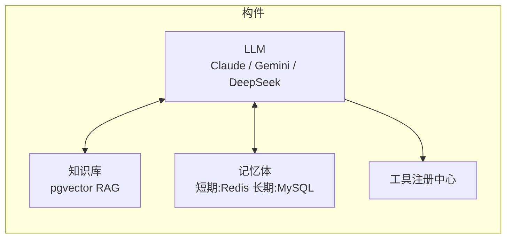
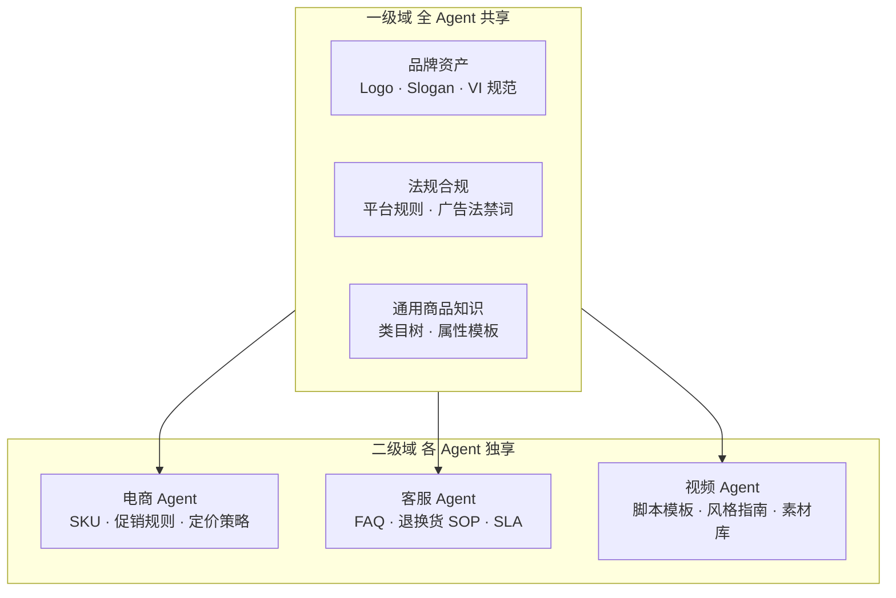
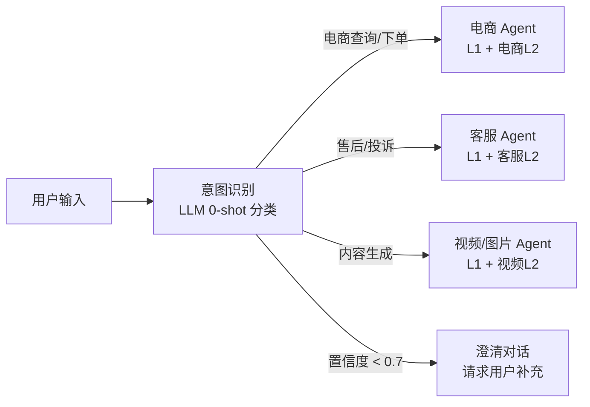
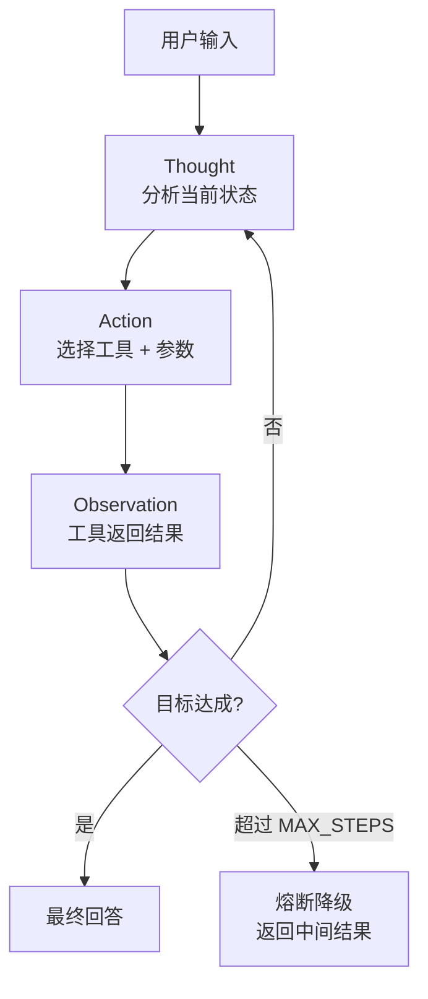

## Agent 核心构件

每个 Agent 由四类构件组成，缺一不可：



| 构件 | 实现 | 作用 |
|------|------|------|
| **LLM** | Claude 3.5 / Gemini 1.5 / DeepSeek | 推理、生成、意图理解 |
| **知识库** | pgvector + BGE-M3 embedding | 领域知识 RAG 召回 |
| **记忆体** | 短期：Redis（会话上下文）；长期：MySQL（用户偏好） | 多轮对话连贯性 |
| **工具** | Tool Registry（JSON Schema 定义） | 执行外部动作 |

---

## 知识库分域设计

知识库按功能角色分区管理，分为**一级域**（共享）和**二级域**（独享）：



**域隔离规则**：
- 一级域（L1）：所有 Agent 均可读取，存储品牌通用知识
- 二级域（L2）：仅归属 Agent 可读取，防止知识污染（如客服 FAQ 不应影响视频生成的脚本风格）

---

## 意图识别与 Agent 路由

Orchestrator 接收用户输入，0-shot 分类后路由到对应 Agent，同时加载 L1 + 对应 L2 知识：



**路由输出结构**：

```json
{
  "agent_type": "CONTENT_GENERATION",
  "confidence": 0.97,
  "domain_level": ["L1", "L2_VIDEO"],
  "entities": {
    "product": "连衣裙",
    "color": "红色",
    "content_type": "短视频"
  }
}
```

---

## ReAct 推理循环



**防无限循环**：

```python
# 连续 2 步相同 tool + args → 检测到循环
if history[-2].tool == action.tool and history[-2].args == action.args:
    return fallback_response("任务执行遇到异常，请重试")

# 超过最大步数 → 返回中间结果
if step >= MAX_STEPS:
    return partial_result(context)
```

---

## Tool 注册中心

Agent 通过 Tool Registry 动态发现和调用工具，LLM 根据工具描述自动选择。

### Tool 定义规范

```json
{
  "name": "product_search",
  "description": "搜索商品库，支持按名称、颜色、类别筛选，返回商品列表含图片 URL",
  "parameters": {
    "type": "object",
    "properties": {
      "query": {
        "type": "string",
        "description": "搜索关键词，如 '红色连衣裙'"
      },
      "filters": {
        "type": "object",
        "properties": {
          "color": { "type": "string" },
          "category": { "type": "string" },
          "min_price": { "type": "number" },
          "max_price": { "type": "number" }
        }
      },
      "limit": {
        "type": "integer",
        "default": 5,
        "maximum": 20
      }
    },
    "required": ["query"]
  }
}
```

### 可用工具清单

| 工具名 | 调用的服务 | 返回值 |
|--------|-----------|--------|
| `product_search` | Product Service | 商品列表 + 图片 URL |
| `inventory_query` | Inventory Service | 可用库存数量 |
| `video_generate` | Content Generator | jobId（异步） |
| `order_create` | Order Service | orderId + 支付链接 |
| `vector_search` | pgvector | 语义相似商品列表 |
| `user_quota_check` | User Service | 视频生成配额 |
| `kb_query` | pgvector（L1/L2 域） | 知识库召回文档 |

---

## 并行工具调用

多个无依赖关系的工具可以并行执行，减少总耗时：

```python
# 串行（慢）
result1 = await product_search(query)   # 200ms
result2 = await user_quota_check(uid)   # 100ms
# 总计 300ms

# 并行（快）
result1, result2 = await asyncio.gather(
    product_search(query),
    user_quota_check(uid)
)
# 总计 max(200, 100) + 调度开销 ≈ 220ms
```

---

## 工具调用安全

<Warning>
  **参数校验**：工具层必须验证所有参数，拒绝非法输入（负数数量、超长文本等）后才传入下游服务。
</Warning>

```python
def execute_tool(tool_name: str, args: dict) -> dict:
    tool = registry.get(tool_name)
    # 1. JSON Schema 校验参数
    validate(args, tool.parameters_schema)
    # 2. 权限检查（用户是否有调用此工具的权限）
    check_permission(current_user, tool_name)
    # 3. 频率限制（防止 Agent 循环调用）
    check_rate_limit(current_session, tool_name)
    # 4. 执行并记录审计日志
    result = tool.execute(args)
    audit_log(tool_name, args, result)
    return result
```
