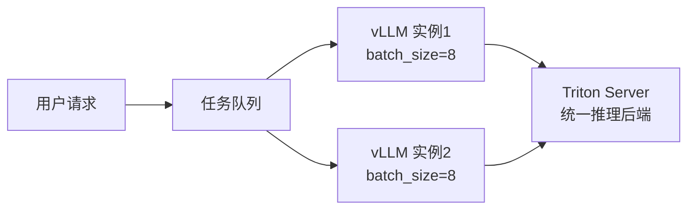

## 异步化与进度推送

视频生成是耗时任务（30s ~ 3min），必须全异步设计：

```
POST /agent/tasks
Body: { "message": "帮我生成红色连衣裙视频" }

Response (立即返回，< 200ms):
{
  "taskId": "T_abc123",
  "status": "PENDING",
  "estimatedTime": 60
}
```

### SSE 实时进度推送

```
GET /agent/tasks/T_abc123/progress
Content-Type: text/event-stream

data: {"step":1,"progress":10,"message":"正在搜索商品信息..."}

data: {"step":2,"progress":20,"message":"配额检查通过，开始生成脚本..."}

data: {"step":4,"progress":70,"message":"视频生成中，预计还需 30 秒..."}

data: {"step":5,"progress":100,"status":"DONE","videoUrl":"https://cdn..."}
```

---

## Bull Queue 任务调度

```javascript
// 提交任务到队列
const videoQueue = new Queue('video-generation', { redis });

await videoQueue.add('generate', {
  jobId: 'J789',
  productImageUrl: 'oss://...',
  script: '春日限定...',
  duration: 30
}, {
  priority: 1,          // 优先级
  attempts: 3,          // 失败重试次数
  backoff: {
    type: 'exponential',
    delay: 2000         // 指数退避：2s → 4s → 8s
  }
});

// Worker 处理
videoQueue.process('generate', async (job) => {
  await job.progress(20);
  const result = await callVideoAPI(job.data);
  await job.progress(90);
  return result;
});
```

---

## 内容去重复用

相同参数的生成任务命中缓存，不重复调用模型 API（**降本约 30%**）：

```python
def get_or_generate_content(params: GenerateParams) -> ContentResult:
    cache_key = f"content:dedup:{sha256(params.to_json())}"

    if cached := redis.get(cache_key):
        metrics.increment('content.cache.hit')
        return ContentResult.from_json(cached)

    metrics.increment('content.cache.miss')
    result = generate_content_pipeline(params)
    redis.setex(cache_key, 7 * 24 * 3600, result.to_json())
    return result
```

---

## GPU 资源池化



**批量推理效果**：

| 模式 | GPU 利用率 | 成本/次 |
|------|-----------|--------|
| 单请求 | ~15% | $0.05 |
| 批量（8 并发） | ~90% | $0.007（降低 6x） |

---

## 内容安全审核

所有生成内容在发布前必须通过安全审核：

```python
async def review_content(content_url: str) -> ReviewResult:
    result = await content_moderation_api.check({
        "url": content_url,
        "scenes": ["porn", "violence", "terrorism", "political"]
    })

    if result.is_blocked:
        await content_job.update_status(
            status=ContentJobStatus.BLOCKED,
            reason=result.block_reason
        )
        await alert(f"内容审核不通过: {result.block_reason}")
        return ReviewResult.BLOCKED

    return ReviewResult.PASSED
```

<Warning>
  状态为 `BLOCKED` 的 ContentJob 不向用户返回任何 URL。前端显示："内容生成审核中，请稍候"。
</Warning>

---

## 配额管理

防止单用户消耗过多 GPU 资源：

| 用户等级 | 每日视频配额 | 单视频最大时长 | 并发限制 |
|---------|------------|--------------|---------|
| 普通用户 | 5 个 | 30s | 1 个 |
| VIP 用户 | 50 个 | 60s | 3 个 |
| 企业用户 | 无限 | 60s | 10 个 |
