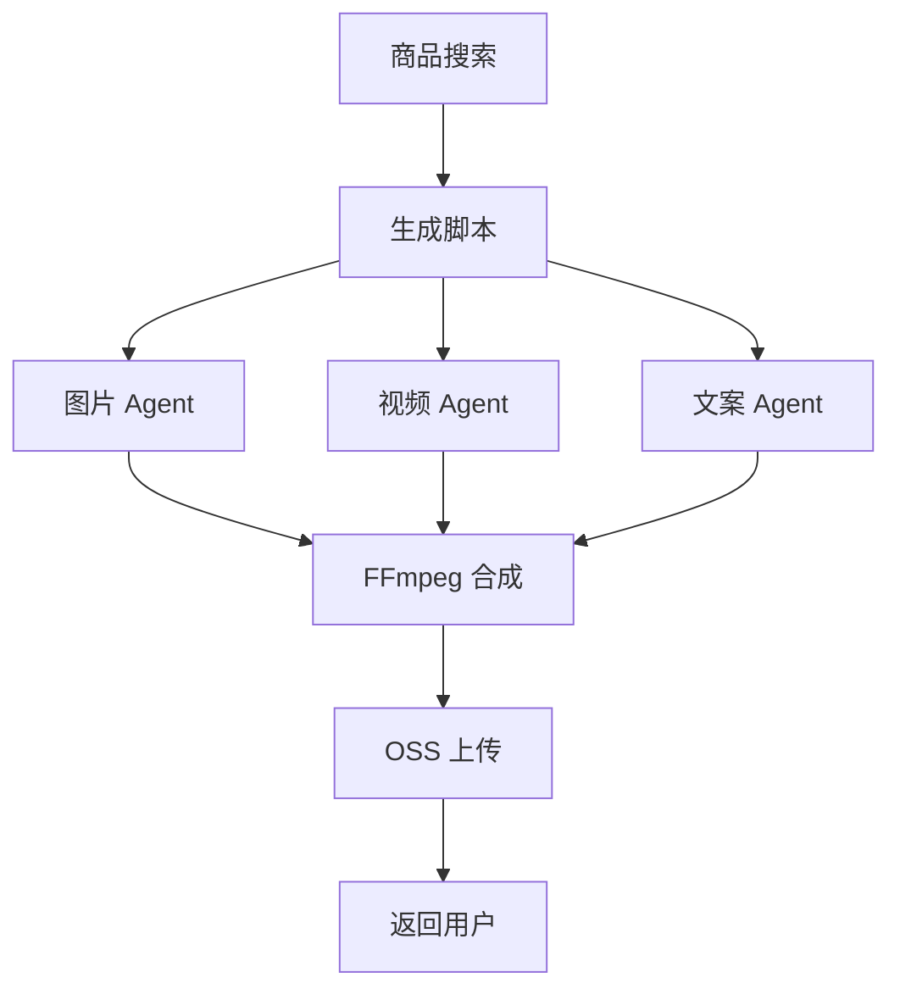
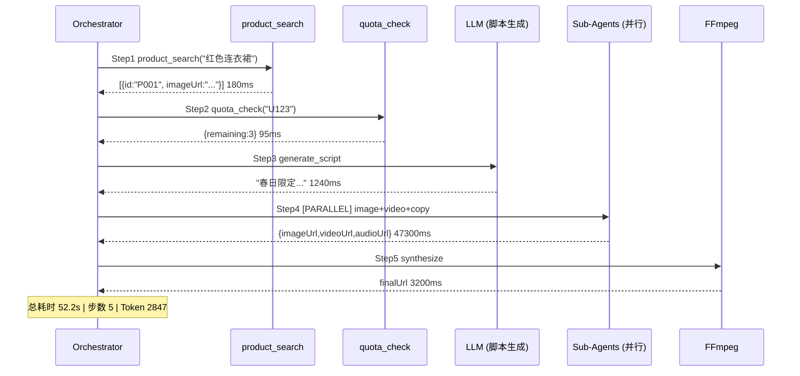

## 端到端流程示例

**用户输入**：`帮我生成一个展示红色连衣裙的短视频`

<Steps>
  <Step title="意图解析（Intent Parsing）">
    LLM 将自然语言转化为结构化意图：

    ```json
    {
      "intent": "CONTENT_GENERATION",
      "confidence": 0.97,
      "entities": {
        "product": "连衣裙",
        "color": "红色",
        "content_type": "短视频",
        "duration": 30
      }
    }
    ```

    置信度 < 0.7 时触发澄清对话："请问您想展示哪款具体的红色连衣裙？"
  </Step>

  <Step title="上下文收集（Context Gathering）">
    并行调用两个 Tool，减少等待时间：

    ```python
    result1, result2 = await asyncio.gather(
        product_search(query="红色连衣裙"),
        user_quota_check(userId="U123")
    )
    # product: [{id:"P001", name:"玫瑰红连衣裙", imageUrl:"oss://...", price:299}]
    # quota: {videoQuota: 5, used: 2, remaining: 3}
    ```
  </Step>

  <Step title="内容规划（Content Planning）">
    LLM 根据商品信息生成视频脚本和分镜方案：

    ```
    脚本：
    0-5s:  产品特写，展示玫瑰红色调
    5-15s: 模特试穿，展示剪裁与版型
    15-25s: 细节展示（面料纹理、拉链工艺）
    25-30s: 品牌 LOGO + 购买链接

    旁白：
    "春日限定，这条红裙让你成为最亮的那道光
     精选面料，舒适垂坠，每一个角度都是惊艳"
    ```
  </Step>

  <Step title="并行生成（Parallel Generation）">
    三路 Sub-Agent 并行执行，由 DAG 调度：

    ```mermaid
    flowchart LR
        Script[生成脚本] --> Img[图片 Agent\nSD/ComfyUI ~8s]
        Script --> Vid[视频 Agent\n文生视频 ~45s]
        Script --> Copy[文案 Agent\nTTS ~3s]
        Img & Vid & Copy --> Merge[FFmpeg 合成]
    ```

    关键路径：视频生成（~45s）
  </Step>

  <Step title="合成与发布（Synthesis & Publish）">
    FFmpeg 合并所有素材，上传 OSS，写入 MongoDB：

    ```bash
    ffmpeg -i video.mp4 -i audio.mp3 -vf subtitles=subtitle.srt \
           -c:v libx264 -c:a aac output.mp4
    ```

    ```json
    {
      "jobId": "J789",
      "status": "DONE",
      "outputUrl": "https://cdn.pixel-step.com/content/v001.mp4",
      "duration": 30,
      "fileSize": "12.3MB",
      "completedAt": "2026-05-25T10:30:45Z"
    }
    ```
  </Step>
</Steps>

---

## DAG 依赖关系图



**关键路径**：商品搜索 → 生成脚本 → 视频 Agent → FFmpeg 合成（约 60s）

---

## ReAct 执行追踪（可观测）

每次执行都记录完整 trace，可通过 LangSmith 查看：


