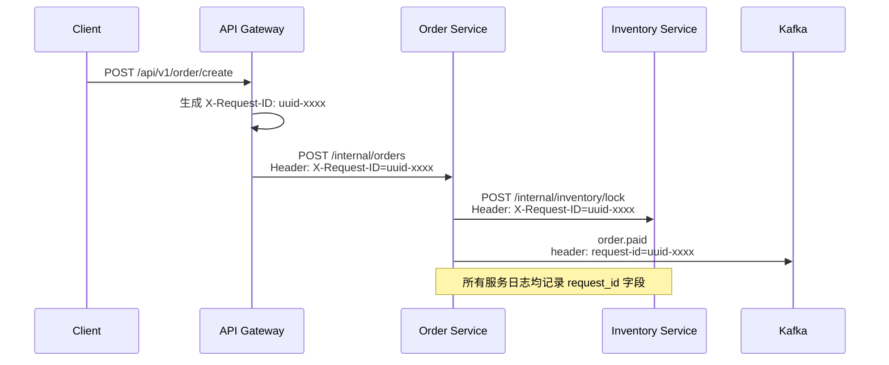
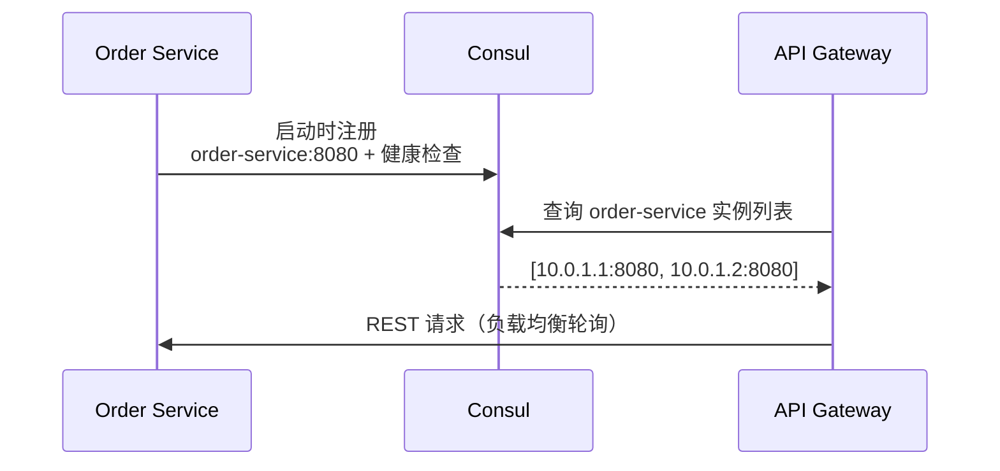
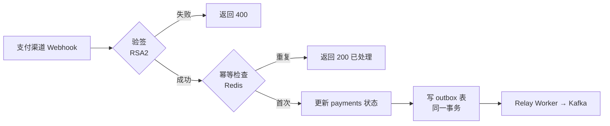
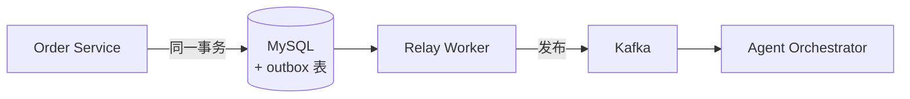
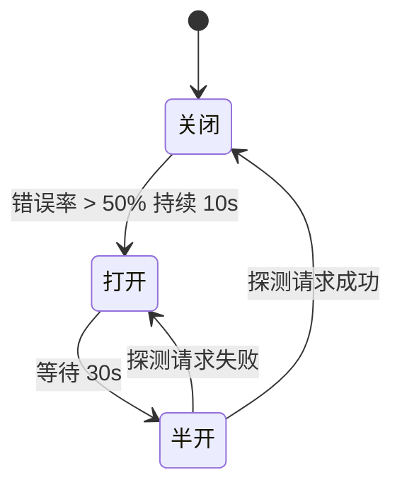

## 通信矩阵

| 调用方 | 被调方 | 协议 | 理由 |
|--------|--------|------|------|
| 客户端 | API Gateway | REST / HTTPS | 对外标准协议，兼容性最好 |
| API Gateway | 各 Service | REST / HTTP | 内网统一 REST，简单易调试 |
| Order Service | Inventory Service | REST（同步） | 锁库存需要即时结果 |
| Order Service | Payment Service | REST（同步） | 发起支付需要同步拿到支付链接 |
| 支付渠道 | Payment Service | Webhook 回调 | 支付宝/微信异步通知支付结果 |
| Payment Service | Kafka | 事务消息 | 支付完成后异步触发后续流程 |
| Kafka | Agent Orchestrator | 异步消费 | 内容生成耗时长，必须解耦 |
| Content Generator | Workflow Service | Webhook 回调 | 子任务完成后通知状态更新 |

---

## API Gateway

Gateway 是系统唯一对外入口，承担所有横切面职责：

<Steps>
  <Step title="JWT 鉴权">
    验证 RS256 签名，解析 userId / roles，注入下游请求 Header
  </Step>
  <Step title="令牌桶限流">
    - 全局限流：10,000 QPS
    - 用户级限流：1,000 QPS / user
    - 超出返回 **429 Too Many Requests**
  </Step>
  <Step title="智能路由">
    根据请求路径 + 版本号路由到对应服务实例（Consul 服务发现）
  </Step>
  <Step title="熔断降级">
    Sentinel 配置熔断规则：错误率 > 50% 持续 10s → 熔断 30s → 半开探测
  </Step>
  <Step title="Request-ID 注入">
    生成全局 Request-ID（UUID v4），注入所有下游请求 Header，实现全链路排查
  </Step>
</Steps>

---

## Request-ID 全链路传播

API Gateway 生成 `X-Request-ID`，贯穿所有服务，是业务排查的核心手段。



**传播规范**：

| 传输方式 | Header/Key | 说明 |
|----------|-----------|------|
| HTTP/REST | `X-Request-ID` | 如客户端已携带则透传 |
| Kafka | message header `request-id` | Producer 写入，Consumer 读取记录 |
| Webhook 回调 | `X-Request-ID` | 透传原始请求 ID |
| 日志 | `request_id` 字段 | 结构化日志必填字段 |

<Tip>
  Request-ID 用于**业务级排查**（"这笔订单为什么失败"），与 Jaeger TraceId 并存。TraceId 用于性能分析（跨服务耗时）。
</Tip>

---

## 服务发现（Consul）



- **注册方式**：Consul agent sidecar，服务启动自动注册
- **健康检查**：HTTP `/health` 接口，每 10s 探活
- **服务发现**：API Gateway 通过 `order-service.service.consul` DNS 解析
- **熔断器**：Sentinel 在 Gateway 侧控制，与 Consul 健康状态联动

---

## Webhook 回调设计

### 支付渠道回调

支付宝/微信支付完成后，主动 POST 到 Payment Service 回调接口：

```
POST /api/v1/payment/callback
Content-Type: application/json
X-Channel-Sign: <RSA2签名>

{
  "tradeNo": "ALI2026...",
  "orderId": "O001",
  "status": "SUCCESS",
  "amount": 299.00,
  "paidAt": "2026-05-26T12:05:00Z"
}
```

**回调处理流程**：



### AIGC 子任务完成回调

Content Generator 子任务（视频生成/图片生成）完成后，回调 Workflow Service：

```
POST /internal/workflow/callback
X-Request-ID: <原始请求ID透传>

{
  "taskId": "AT001",
  "workflowId": "T1749876543210",
  "status": "DONE",
  "output": {
    "url": "oss://pixel-step/content/v001.mp4",
    "durationMs": 47300
  }
}
```

---

## Kafka 异步消息

### Topic 设计

| Topic | 生产者 | 消费者 | 用途 |
|-------|--------|--------|------|
| `order.paid` | Payment Service | Agent Orchestrator | 支付成功触发内容生成 |
| `content.job.created` | Agent Orchestrator | Content Generator | 创建生成任务 |
| `content.job.done` | Content Generator | Notification Service | 内容完成推送通知 |
| `order.dlq` | 各 Consumer | DLQ Monitor | 死信队列人工干预 |

### 事务消息（Outbox Pattern）



```sql
-- 同一事务写入 DB + outbox 表
BEGIN;
  UPDATE payments SET status='PAID' WHERE payment_id = ?;
  INSERT INTO outbox (topic, key, payload, request_id)
  VALUES ('order.paid', ?, '{"orderId":"..."}', ?);
COMMIT;
```

<Tip>
  Outbox Pattern 是替代 XA 事务的轻量方案：DB 事务保证本地原子性，Relay Worker 保证最终投递。
</Tip>

---

## 熔断器状态机


