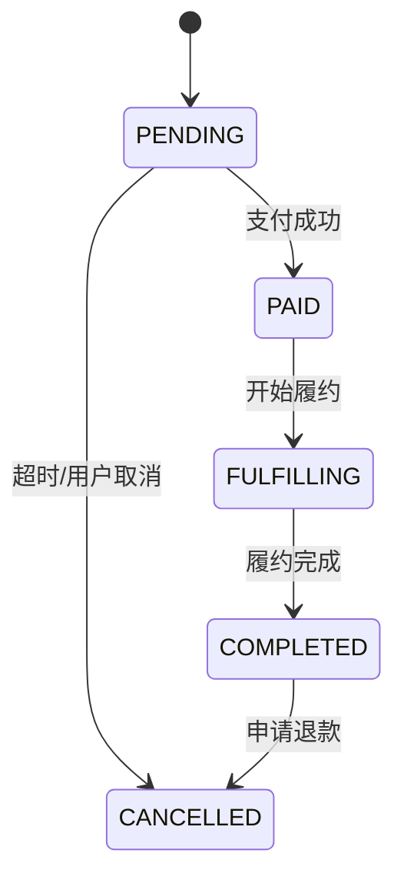
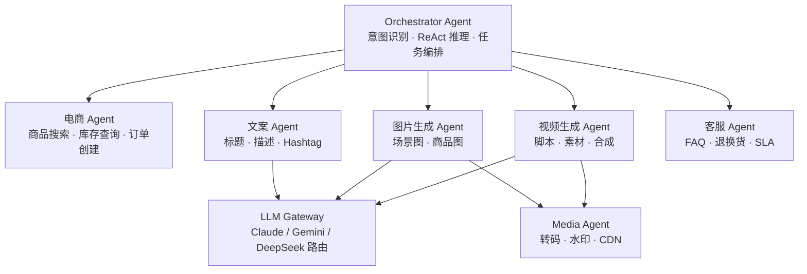
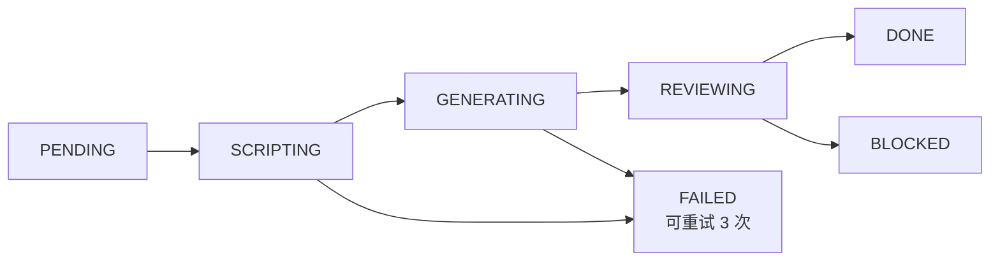
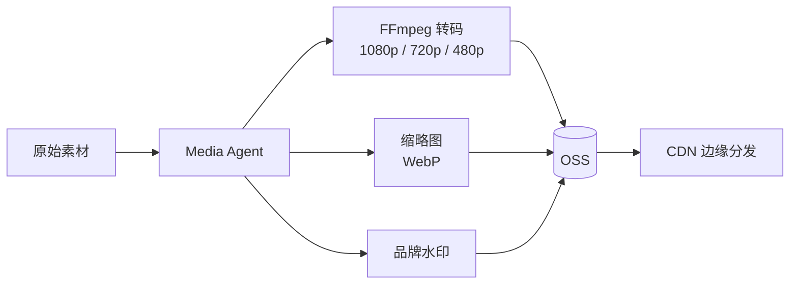

## 划分原则

<CardGroup cols={2}>
  <Card title="业务域隔离" icon="border-all">
    每个服务对应一个限界上下文，不跨域操作其他服务的数据库
  </Card>
  <Card title="单一职责" icon="bullseye">
    每个服务只做一件事，职责清晰，避免"大泥球"
  </Card>
  <Card title="独立部署" icon="rocket">
    每个服务可独立构建、测试、发布，互不影响
  </Card>
  <Card title="按需扩容" icon="arrows-up-down">
    高负载服务（Inventory、Agent）可独立水平扩展
  </Card>
</CardGroup>

---

## 电商交易侧

### Order Service（订单服务）

**核心职责**：订单全生命周期管理，作为 Saga 编排协调者

**核心实体**：

**状态机流转**：



<Warning>
  状态机只允许合法跳转。`COMPLETED → PENDING` 这类回退操作会被服务层拦截并返回 400。
</Warning>

---

### Inventory Service（库存服务）

**核心职责**：库存查询、预占锁定、实际扣减、超时释放

**为什么独立出来**：库存是全局共享资源，独立服务后可水平扩展，不受订单服务影响。

**核心接口（REST）**：

| 方法 | 路径 | 说明 |
|------|------|------|
| POST | `/internal/inventory/lock` | 预占库存 |
| POST | `/internal/inventory/release` | 释放库存 |
| POST | `/internal/inventory/deduct` | 实际扣减 |
| GET  | `/api/v1/inventory/query` | 查询库存 |

---

### Payment Service（支付服务）

**核心职责**：支付渠道适配（支付宝/微信支付/Stripe）、异步回调处理、退款

**关键设计**：
- 回调接口强制验签（RSA2），防止伪造支付成功通知
- 支付结果通过 **事务消息** 发布到 Kafka，保证 DB 更新与消息发布的原子性

---

### Product Service（商品服务）

**核心职责**：商品信息 CRUD、SKU 管理、价格策略

**搜索扩展**：商品数据双写到 Elasticsearch（全文搜索）和 pgvector（语义向量检索）

---

## AIGC Agent 侧

系统按职责将 AIGC 能力拆分为多个专职 Agent，通过 Orchestrator 统一调度，彼此通过 REST API / Webhook 通信。



### Orchestrator Agent

**职责**：用户意图理解、ReAct 推理循环、Tool Call 调度、路由到专职 Agent。

详见 [Agent 设计](/agent/design) 章节。

---

### 视频生成 Agent

**职责**：接收脚本和商品素材，驱动外部视频 API（可灵/即梦），返回视频文件 URL。

**任务状态机**：



---

### 图片生成 Agent

**职责**：调用 SD/ComfyUI 生成商品场景图，支持风格控制（写实/插画/3D）。

---

### 文案 Agent

**职责**：调用 DeepSeek-Chat 生成商品标题、详情文案、Hashtag、营销话术。

---

### 客服 Agent

**职责**：基于 L2 知识库（FAQ/退换货 SOP/SLA）回答用户问题，无法处理时转人工。

---

### LLM Gateway

**职责**：统一管理所有 LLM 调用，提供：
- 模型路由（Claude / Gemini / DeepSeek 故障切换）
- Token 使用量统计与限额
- Prompt 缓存（相同 Prompt Hash 复用结果）
- 请求并发控制

---

### Media Agent

**职责**：视频/图片转码、缩略图生成、水印叠加、上传 OSS 并刷新 CDN。



---

### Workflow Agent

**职责**：AIGC 任务全生命周期状态管理、重试调度、进度持久化（存 MySQL workflow_tasks 表）。

**为什么独立**：Orchestrator 负责推理，Workflow Agent 负责持久化与重试，拆分后 Orchestrator 可无状态水平扩展。

**重试策略**：

| 场景 | 重试次数 | 退避策略 |
|------|---------|---------|
| 视频生成失败 | 3 次 | 指数退避（1min / 4min / 16min） |
| 文案生成失败 | 5 次 | 固定间隔（30s） |
| 超时未完成 | 2 次 | 立即重试 |
| 审核拦截 | 0 次 | 进死信队列，人工干预 |

---

### Prompt Agent

**职责**：Prompt 模板版本管理，支持不发布代码即可更新 Prompt，以及 A/B 流量分配。

```
场景：video_script
  └── v3（当前，流量 80%）："你是专业视频脚本作者，为{{product_name}}生成..."
  └── v2（对照，流量 20%）："请为{{product_name}}创作..."
```
