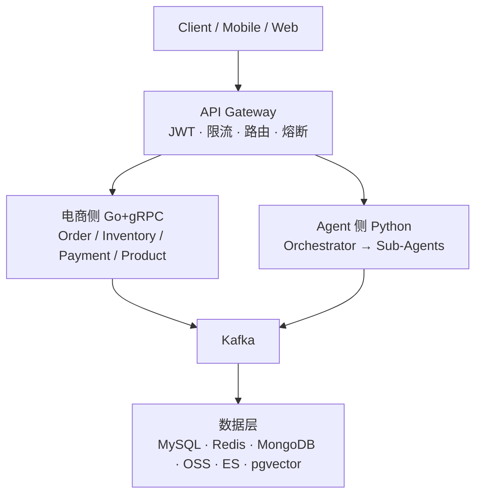

## 架构总览

## 架构分层

| 层级 | 组件 | 协议 |
|------|------|------|
| 接入层 | API Gateway (Nginx) | HTTPS / WebSocket |
| 业务层 | 6 个 Go 微服务 | gRPC |
| 消息层 | Kafka | 异步事件 |
| Agent 层 | Python + LangChain | ReAct / Tool Use |
| 数据层 | MySQL / Redis / MongoDB / OSS / ES / pgvector | 各自协议 |

## 设计决策

<AccordionGroup>
  <Accordion title="为什么选微服务而不是单体架构？" icon="question">
    电商侧（Go + gRPC）和 AIGC 侧（Python + GPU）技术栈完全不同，强行合并会导致：
    - 部署耦合：Go 服务的快速迭代被 Python 慢速部署拖累
    - 资源隔离：GPU 资源只有 AIGC 侧需要，单体无法独立扩容
    - 故障隔离：AIGC 生成任务异常不应影响下单支付
  </Accordion>
  <Accordion title="为什么 API Gateway 要独立一层？" icon="question">
    所有跨切面关注点（鉴权、限流、追踪）统一在 Gateway 处理，避免：
    - 每个微服务重复实现鉴权逻辑
    - 限流策略分散、不一致
    - Request-ID 注入遗漏导致链路断裂
  </Accordion>
  <Accordion title="Kafka 为什么单独作为一层？" icon="question">
    电商高并发（下单/支付完成）和 AIGC 长耗时（视频生成）天然匹配异步解耦：
    - 支付完成后不需要同步等待视频生成
    - Kafka 的持久化保证消息不丢失
    - Consumer Group 水平扩展，削峰填谷
  </Accordion>
</AccordionGroup>

## 服务清单

| 服务 | 技术 | 职责 |
|------|------|------|
| API Gateway | Nginx + Consul | 统一入口、鉴权、限流、路由 |
| Order Service | Go + gRPC | 订单创建、状态机、幂等控制 |
| Inventory Service | Go + gRPC | 库存查询、预占、扣减、释放 |
| Payment Service | Go + gRPC | 支付渠道适配、回调处理 |
| User Service | Go + gRPC | 账户管理、RBAC 权限 |
| Product Service | Go + gRPC | 商品信息、SKU 管理 |
| Notification Service | Go | 短信/邮件/站内信推送 |
| Agent Orchestrator | Python + LangChain | 意图解析、ReAct 编排 |
| Content Generator | Python | 视频/图片/文案生成流水线 |
| LLM Gateway | Python | 统一 LLM 接入、Token 计量 |

<Note>
  电商侧（7 个服务）使用 **Go** 保证高吞吐低延迟；AIGC 侧（3 个服务）使用 **Python** 配合 LangChain 生态和 GPU 推理库。
</Note>
