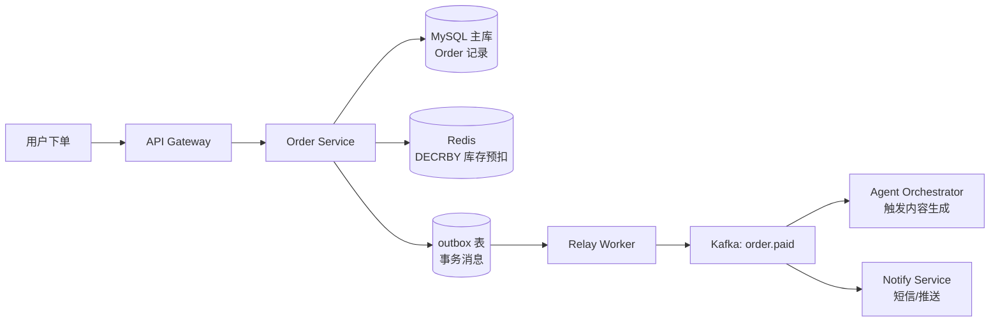
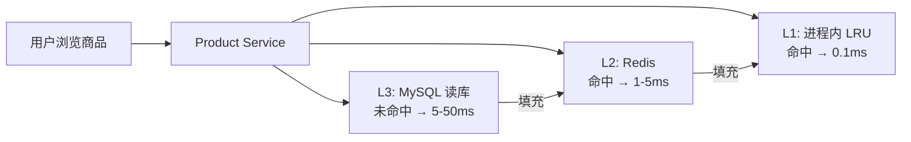
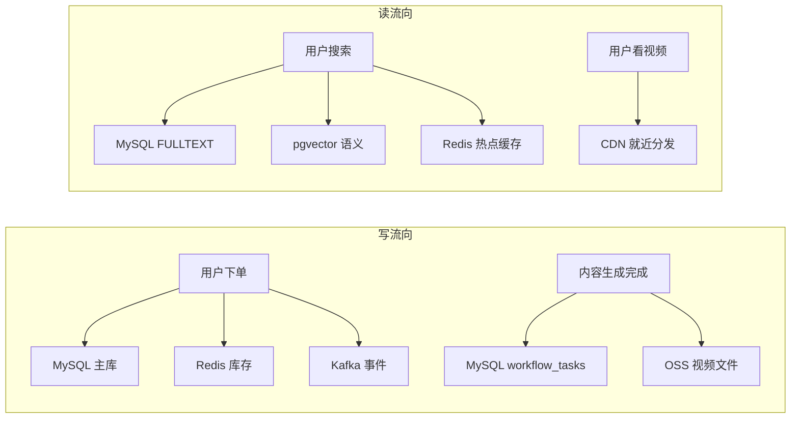

## 写路径（下单全链路）



## 读路径（商品详情）



## 商品双写策略

商品信息变更时，同步更新 MySQL 主库和 Redis 缓存，异步更新 pgvector 向量：

```python
class ProductService:
    async def update_product(self, product: Product):
        # 1. 写主库
        await self.mysql.update(product)

        # 2. 更新 Redis 缓存（直写，保持一致）
        await self.redis.setex(
            f"product:{product.id}",
            300,
            product.to_json()
        )

        # 3. MySQL FULLTEXT 自动索引，无需额外写入

        # 4. 更新 pgvector 向量（异步，不阻塞响应）
        asyncio.create_task(
            self.pgvector.upsert(product.id, self._embed(product))
        )
```

<Note>
  pgvector 向量更新是异步的，允许最多 1 分钟的语义搜索延迟。MySQL / Redis 是同步更新，保证强一致。
</Note>

## 数据流向总览


