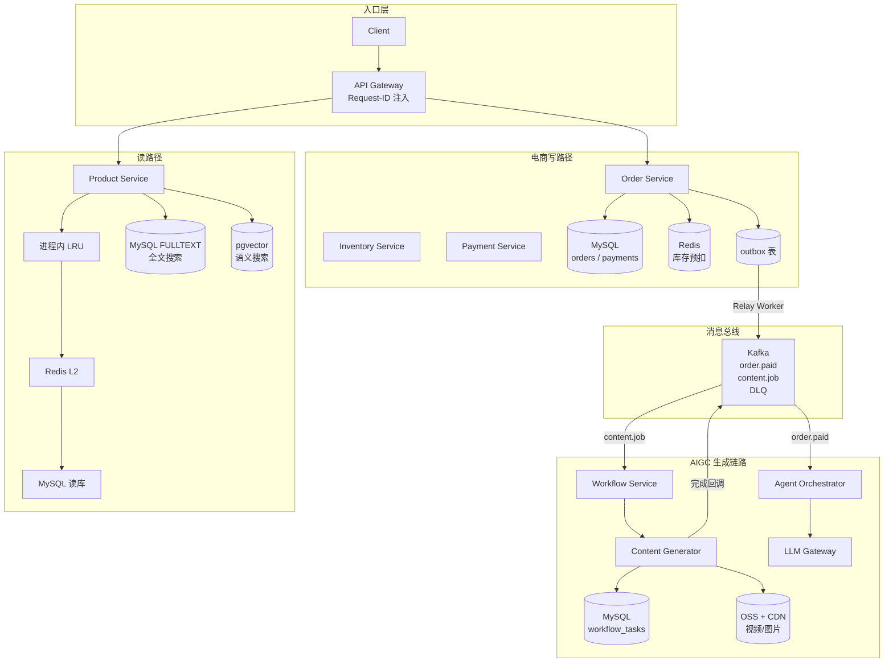
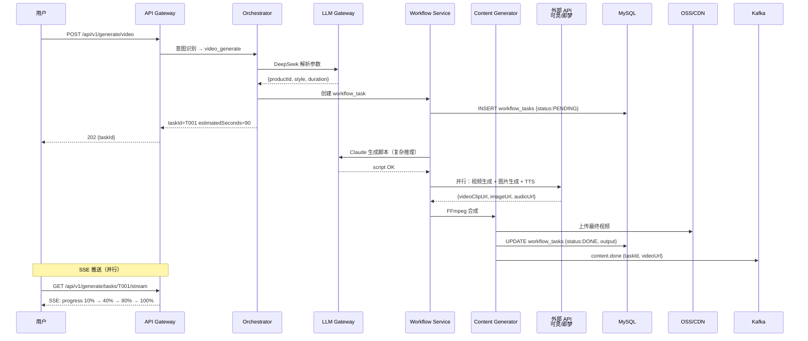
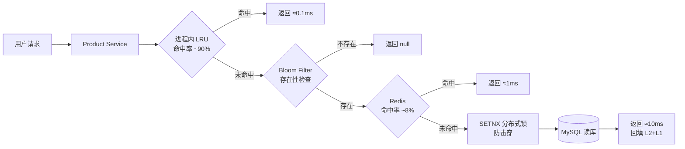
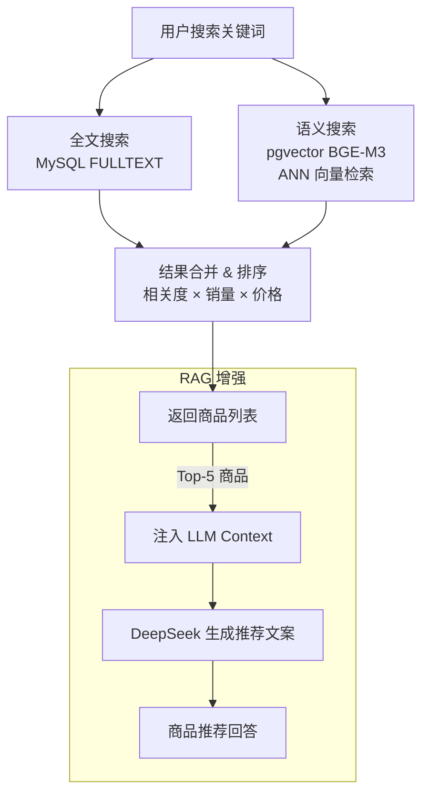

## 全局数据流总览



---

## 电商交易写路径

```mermaid
sequenceDiagram
    participant U as 用户
    participant GW as API Gateway
    participant OS as Order Service
    participant IS as Inventory Service
    participant PS as Payment Service
    participant DB as MySQL
    participant R as Redis
    participant K as Kafka

    U->>GW: POST /api/v1/order/create
    GW->>GW: 生成 X-Request-ID
    GW->>OS: REST POST /internal/orders (request-id)
    OS->>R: DECRBY stock:sku:SKU001 2   ①Redis 原子预扣
    R-->>OS: 剩余库存 21
    OS->>IS: REST POST /internal/inventory/lock
    IS-->>OS: LOCKED
    OS->>DB: BEGIN; INSERT orders; INSERT outbox; COMMIT  ③事务写入
    OS-->>GW: orderId=O001 status=PENDING
    GW-->>U: 202 {orderId, paymentDeadline}

    U->>GW: POST /api/v1/payment/pay
    GW->>PS: REST POST /internal/payment/initiate
    PS-->>GW: {payUrl}
    GW-->>U: 200 {payUrl}

    Note over PS,K: 支付回调（异步）
    PS->>DB: BEGIN; UPDATE payments; INSERT outbox; COMMIT
    DB-->>PS: OK
    PS->>K: [Relay Worker] order.paid {orderId}
    K->>OS: 消费 order.paid → 更新 PAID
```

---

## AIGC 内容生成链路



---

## 商品读路径（多级缓存）



---

## 商品搜索路径



---

## 跨域数据同步

| 同步方向 | 触发时机 | 方式 | 延迟容忍 |
|---------|---------|------|---------|
| MySQL → Redis 库存 | 服务启动 / 每日凌晨对账 | 定时任务全量同步 | 分钟级 |
| MySQL FULLTEXT | 商品变更 | MySQL 自动更新 FULLTEXT 索引 | 实时 |
| MySQL → pgvector | 商品变更 | 异步任务（可接受 1 分钟延迟） | 分钟级 |
| Kafka → MySQL | AIGC 任务状态变更 | Consumer 实时写入 | 秒级 |
| MySQL workflow_tasks → OSS | 内容生成完成 | Content Generator 直接上传 | 实时 |

<Note>
  跨域同步均采用**最终一致**策略，不存在跨服务分布式事务。强一致要求（如下单扣库存）在单服务内通过 Redis Lua 脚本 + DB 乐观锁保证。
</Note>
