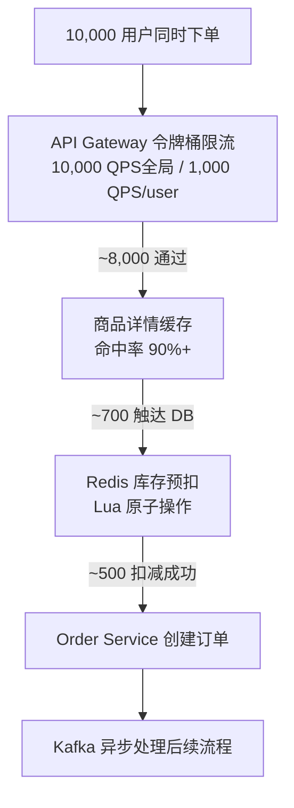
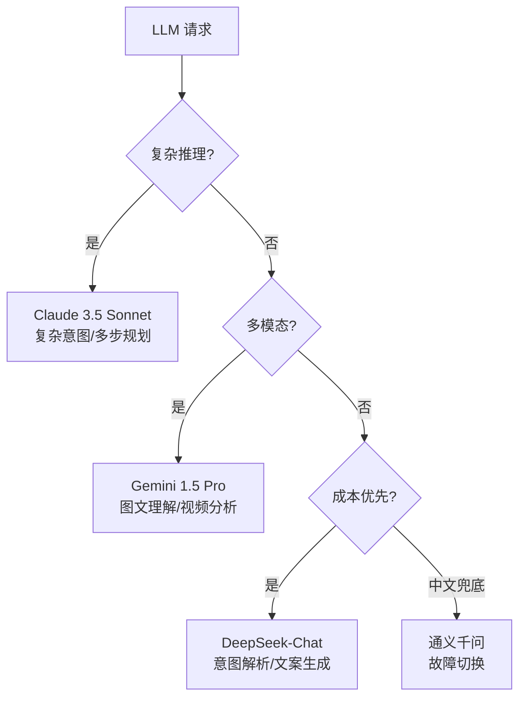

## 大促流量漏斗



---

## 多级缓存

| 层级 | 实现 | TTL | 命中率 | 延迟 |
|------|------|-----|--------|------|
| L1 | 进程内 LRU（Caffeine） | 60s | ~85% | 0.1ms |
| L2 | Redis Cluster | 300s | ~13% | 1-5ms |
| L3 | MySQL 读库 | - | ~2% | 5-50ms |

### 缓存三击防护

<Tabs>
  <Tab title="防缓存穿透">
    **问题**：查询不存在的 ID，每次都打到 DB

    **方案**：Bloom Filter 拦截

    ```python
    from bloom_filter2 import BloomFilter

    bloom = BloomFilter(max_elements=10_000_000, error_rate=0.001)
    for pid in db.query("SELECT id FROM products"):
        bloom.add(str(pid))

    def get_product(product_id: str):
        if str(product_id) not in bloom:
            return None
        # ... 正常缓存查询流程
    ```
  </Tab>
  <Tab title="防缓存击穿">
    **问题**：热点 Key 过期瞬间，大量请求同时回源 DB

    **方案**：SETNX 互斥锁

    ```python
    def get_product_with_lock(product_id: str):
        cache_key = f"product:{product_id}"
        if v := redis.get(cache_key):
            return v

        lock_key = f"lock:product:{product_id}"
        if redis.set(lock_key, '1', nx=True, ex=10):
            try:
                v = db.query_product(product_id)
                redis.setex(cache_key, 300 + random.randint(-30, 30), v)
                return v
            finally:
                redis.delete(lock_key)
        else:
            time.sleep(0.05)
            return redis.get(cache_key)
    ```
  </Tab>
  <Tab title="防缓存雪崩">
    **问题**：大批 Key 同时过期，DB 被压垮

    **方案**：随机 TTL + 定时预热

    ```python
    BASE_TTL = 300

    def set_with_jitter(key: str, value: str):
        ttl = BASE_TTL + random.randint(-60, 60)
        redis.setex(key, ttl, value)

    async def preheat_hot_products():
        hot_products = db.query_top_n_products(limit=1000)
        for p in hot_products:
            redis.setex(f"product:{p.id}", 3600, p.to_json())
    ```
  </Tab>
</Tabs>

---

## 秒杀专项优化

| 流程 | 路径 | TPS |
|------|------|-----|
| 普通下单 | Gateway → Order Service → Inventory DB | ~5,000 |
| 秒杀专项 | Gateway → 秒杀 Service（Redis 全程）→ 异步写 DB | ~100,000+ |

```
活动开始前：将 1000 件库存写入 Redis key: flash_sale:{activityId}
用户抢购：   DECR flash_sale:{activityId}
扣减 > 0：  异步创建订单（写 Kafka）
扣减 = 0：  直接返回 "已售罄"，不打 DB
```

---

## AIGC 侧性能优化

### 批量推理降本

| 模式 | GPU 利用率 | 成本/次 |
|------|-----------|--------|
| 单请求 | ~12% | $0.05 |
| 批量（8并发） | ~90% | $0.007（降低 7x） |

```
vLLM 配置：
  max_batch_size = 8
  dynamic_batching = true
  waiting_timeout_ms = 50  # 最多等 50ms 凑批
```

### LLM 路由策略



```python
def route_llm_request(task: LLMTask) -> str:
    if task.type == "complex_reasoning":
        return "claude-3-5-sonnet"      # 复杂推理、多步规划
    elif task.type == "multimodal":
        return "gemini-1-5-pro"         # 图文理解、视频分析
    elif task.type in ("intent_parsing", "script_writing"):
        return "deepseek-chat"          # 成本优先
    else:
        return "qwen-turbo"             # 中文兜底
```

<Note>
  Claude 和 Gemini 用于高价值场景（复杂推理、多模态），DeepSeek 用于高频低复杂度任务（意图解析、简单文案），综合成本最优。
</Note>
