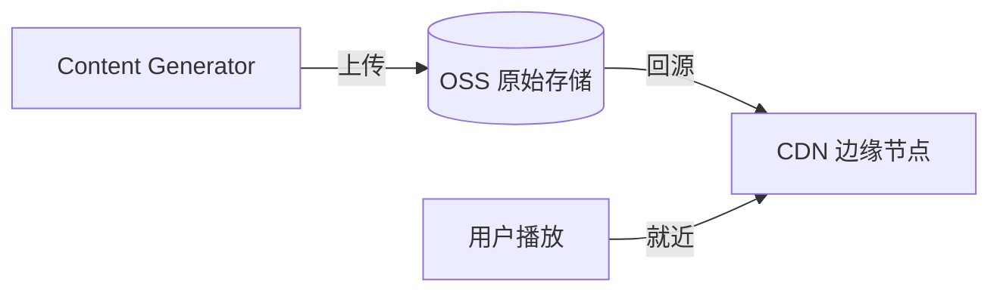
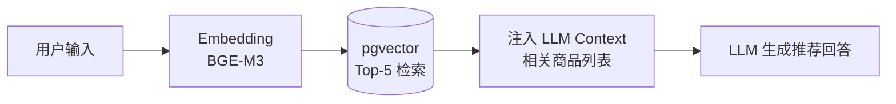

## 选型矩阵

| 数据类型 | 存储方案 | 选型理由 |
|---------|---------|---------|
| 订单 / 用户 / 支付 | **MySQL**（主从 + 分库） | ACID 事务，按 user_id 分片，读写分离 |
| 库存 / Session / 缓存 / 队列 | **Redis** | 原子操作、Pub/Sub、Sorted Set、Lua 脚本 |
| 商品基础信息 | MySQL + Redis 二级缓存 | 热点商品缓存命中率 ~90%，TTL 5 分钟 |
| AIGC 任务 / 内容 Job | **MySQL**（workflow_tasks 表） | 统一存储，支持复杂查询和事务 |
| 商品图片 / 生成视频 | **OSS + CDN** | 大文件存储，CDN 边缘节点加速分发 |
| 商品语义搜索 | **pgvector**（MySQL 向量扩展） | ANN 检索，以图搜图，RAG 召回 |

---

## MySQL 分库分表

订单量大，单表难以支撑，按 `user_id` 分 16 库 × 32 表：

```sql
-- 分片键：user_id
-- 库编号：user_id % 16
-- 示例：user_id=1000 → db_order_08

CREATE TABLE orders_${0..31} (
    order_id     BIGINT       PRIMARY KEY,
    user_id      BIGINT       NOT NULL,
    status       VARCHAR(20)  NOT NULL DEFAULT 'PENDING',
    total_amount DECIMAL(12,2),
    pay_amount   DECIMAL(12,2),
    request_id   VARCHAR(64),
    created_at   DATETIME     DEFAULT NOW(),
    INDEX idx_user_created (user_id, created_at)
);
```

**读写分离**：主库处理写操作，从库处理查询，通过 ShardingSphere 自动路由。

---

## Redis 多能力矩阵

Redis 在本系统承担多重角色，不止是缓存：

| 数据结构 | 使用场景 | 示例 Key |
|---------|---------|---------|
| **String** | 商品缓存、幂等结果、Session Token | `product:{id}` `idempotent:{key}` |
| **Hash** | 用户购物车、SKU 属性 | `cart:{userId}` |
| **Sorted Set** | 热门商品排行、任务优先级队列 | `rank:sales:daily` |
| **List** | 异步任务队列（Bull Queue 底层） | `bull:video-gen:wait` |
| **Pub/Sub** | AIGC 任务进度实时推送 | `progress:{taskId}` |
| **Lua Script** | 库存原子预扣（防超卖） | — |
| **Cluster** | 高可用，3 主 3 从，自动故障转移 | — |

**库存原子预扣（Lua 脚本）**：

```lua
local key = KEYS[1]  -- stock:sku:{skuId}
local amount = tonumber(ARGV[1])
local current = tonumber(redis.call('GET', key))
if current == nil or current < amount then
  return -1
end
return redis.call('DECRBY', key, amount)
```

**AIGC 进度推送（Pub/Sub）**：

```python
# Content Generator 发布进度
redis.publish(f"progress:{task_id}", json.dumps({
    "step": 4, "progress": 80, "message": "视频生成中..."
}))

# SSE 接口订阅并转发给客户端
for message in redis.subscribe(f"progress:{task_id}"):
    yield f"data: {message['data']}\n\n"
```

---

## AIGC 任务存储（MySQL）

用 MySQL 替代 MongoDB 存储任务元数据，利用 JSON 列支持灵活 schema：

```sql
CREATE TABLE workflow_tasks (
    task_id      BIGINT       PRIMARY KEY,
    user_id      BIGINT       NOT NULL,
    type         VARCHAR(30)  NOT NULL,      -- VIDEO_GENERATION | IMAGE_GENERATION | COPY_WRITING
    status       VARCHAR(20)  NOT NULL DEFAULT 'PENDING',
    progress     TINYINT      NOT NULL DEFAULT 0,
    priority     TINYINT      NOT NULL DEFAULT 1,
    input_json   JSON         NOT NULL,      -- 生成参数
    steps_json   JSON,                       -- 各步骤执行记录
    output_json  JSON,                       -- 完成后的输出
    error_msg    VARCHAR(500),
    retry_count  TINYINT      NOT NULL DEFAULT 0,
    cache_key    VARCHAR(64),                -- SHA256 去重
    request_id   VARCHAR(64),
    created_at   DATETIME     DEFAULT NOW(),
    updated_at   DATETIME     DEFAULT NOW() ON UPDATE NOW(),
    INDEX idx_user_status (user_id, status),
    INDEX idx_cache_key   (cache_key)
);
```

---

## OSS + CDN



存储路径规范：
- 商品图片：`oss://pixel-step/products/{productId}/{hash}.jpg`
- 生成视频：`oss://pixel-step/content/{year}/{month}/{jobId}.mp4`

---

## pgvector 语义检索

使用 pgvector 扩展存储商品向量，与 MySQL 主库并行使用（独立 PostgreSQL 实例仅用于向量检索）：

```sql
CREATE EXTENSION IF NOT EXISTS vector;

CREATE TABLE product_embeddings (
    product_id  BIGINT PRIMARY KEY,
    embedding   vector(768),    -- BGE-M3 输出维度
    metadata    JSON
);

CREATE INDEX ON product_embeddings
    USING hnsw (embedding vector_cosine_ops)
    WITH (m = 16, ef_construction = 64);
```

```python
def semantic_search(query: str, top_k: int = 5):
    query_vector = bge_m3_model.encode(query)
    results = db.execute("""
        SELECT product_id, metadata,
               1 - (embedding <=> %s) AS score
        FROM product_embeddings
        ORDER BY embedding <=> %s
        LIMIT %s
    """, (query_vector, query_vector, top_k))
    return [r for r in results if r.score > 0.75]
```

**RAG 增强流程**：


