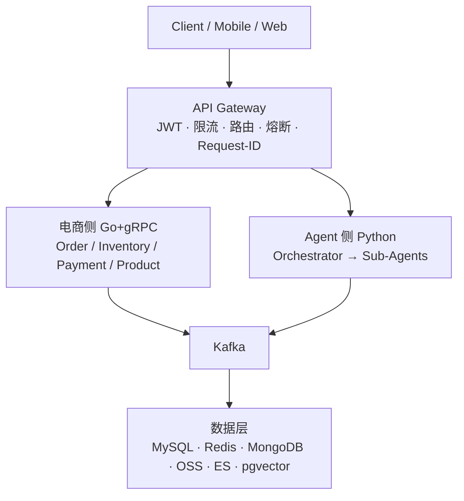

## 系统概述

公司计划构建一个 **AI 电商内容生成平台**，系统需要同时满足两条业务主线：

<CardGroup cols={2}>
  <Card title="电商交易" icon="cart-shopping" color="#f59e0b">
    处理下单、支付、库存核心链路，要求**高并发、强一致、低延迟**
  </Card>
  <Card title="AIGC 内容生成" icon="video" color="#8b5cf6">
    支持用户生成 AI 商品视频/图片/文案，天然**异步、长耗时、多模态**
  </Card>
</CardGroup>

## 设计原则

<CardGroup cols={2}>
  <Card title="高内聚低耦合" icon="sitemap">
    按业务域划分微服务，数据库不跨服务共享，单一职责
  </Card>
  <Card title="异步优先" icon="arrow-right-arrow-left">
    AIGC 生成链路全异步，不阻塞电商交易主链路
  </Card>
  <Card title="最终一致" icon="check-circle">
    分布式事务采用 Saga 模式，接受短暂不一致，保证最终一致
  </Card>
  <Card title="防御性设计" icon="shield">
    幂等、熔断、限流、补偿事务多重兜底保护
  </Card>
</CardGroup>

## 核心架构分层

## 系统能力全景

<CardGroup cols={3}>
  <Card title="电商核心链路" icon="cart-shopping" color="#f59e0b">
    下单 / 支付 / 库存 / 防超卖 / 幂等
  </Card>
  <Card title="AIGC 内容生成" icon="video" color="#8b5cf6">
    视频 / 图片 / 文案 / 异步任务 / GPU 池化
  </Card>
  <Card title="Agent 智能对话" icon="robot" color="#06b6d4">
    意图识别 / ReAct 推理 / 知识库分域 / 工具调用
  </Card>
  <Card title="数据与存储" icon="database" color="#22c55e">
    MySQL + Redis / pgvector 语义检索 / OSS + CDN
  </Card>
  <Card title="性能优化" icon="gauge" color="#ef4444">
    多级缓存 / LLM 路由 / 大促限流 / 内容去重
  </Card>
  <Card title="可观测性" icon="chart-line" color="#64748b">
    Metrics / Traces / Logs / Request-ID 全链路
  </Card>
</CardGroup>

<Note>
  **TODO（后续可扩展）**：多租户/多品牌隔离、营销活动引擎（秒杀/拼团）、内容 A/B 实验平台、国际化多语言、自研向量模型训练
</Note>

## 快速导航

<CardGroup cols={3}>
  <Card title="系统架构设计" icon="sitemap" href="/architecture/overview">
    微服务划分、API Gateway、服务间通信矩阵
  </Card>
  <Card title="Agent 设计" icon="robot" href="/agent/design">
    核心构件、知识库分域、ReAct 框架、Tool Use
  </Card>
  <Card title="分布式事务" icon="arrows-rotate" href="/transactions/saga">
    Saga 模式、库存防超卖、幂等与补偿
  </Card>
  <Card title="数据存储" icon="database" href="/data/storage">
    多模态存储选型、pgvector 语义检索
  </Card>
  <Card title="性能优化" icon="gauge" href="/data/performance">
    多级缓存、大促限流、LLM 路由策略
  </Card>
  <Card title="可观测性" icon="chart-line" href="/observability/monitoring">
    Metrics / Traces / Logs 三支柱、Request-ID 全链路
  </Card>
</CardGroup>
