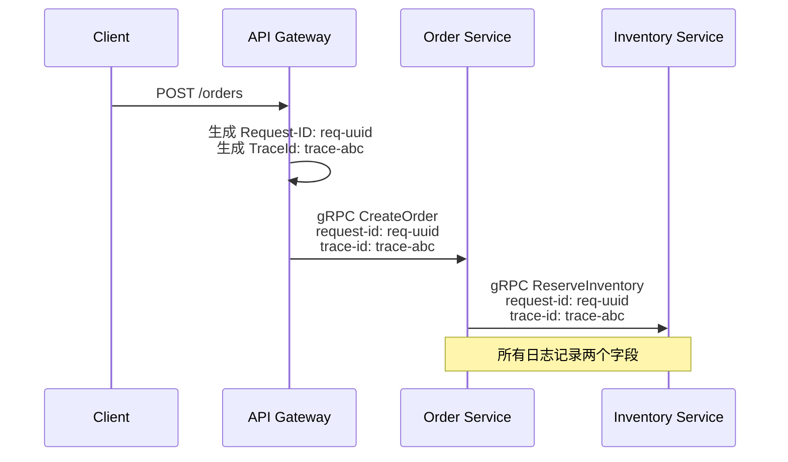

## 三支柱

<CardGroup cols={3}>
  <Card title="Metrics" icon="chart-line" color="#22c55e">
    **Prometheus + Grafana**

    收集业务指标、系统指标，可视化大盘，触发告警
  </Card>
  <Card title="Traces" icon="route" color="#4a9eed">
    **Jaeger + OpenTelemetry**

    全链路 Request-ID + TraceId，跨服务调用可视化，定位性能瓶颈
  </Card>
  <Card title="Logs" icon="file-lines" color="#8b5cf6">
    **ELK Stack**

    结构化日志，Request-ID / TraceId 双字段关联，全文检索异常
  </Card>
</CardGroup>

---

## 全链路 Request-ID + TraceId

两个 ID 并存，各有分工：



| 字段 | 用途 | 生成方 |
|------|------|--------|
| `request_id` | 业务级排查（"这笔订单为什么失败"） | API Gateway |
| `trace_id` | 性能分析（跨服务耗时瀑布图） | OpenTelemetry |

---

## 核心 SLO

| 服务 | 指标 | 目标值 | 告警阈值 |
|------|------|--------|---------|
| Order Service | 创建成功率 | ≥ 99.9% | < 99.5% |
| Payment Callback | 处理 P99 | ≤ 500ms | > 1000ms |
| 库存扣减 | 超卖率 | = 0 | > 0（立即） |
| Video Generation | 任务完成率 | ≥ 95% | < 90% |
| Agent Chat | 响应 P95 | ≤ 3s | > 5s |
| 向量搜索 | P99 延迟 | ≤ 100ms | > 200ms |

---

## 关键业务指标（Prometheus）

```python
# 订单相关
order_created_total = Counter('order_created_total', '创建订单总数', ['status'])
order_value_amount = Histogram('order_value_amount', '订单金额分布')

# 库存相关
inventory_deduct_total = Counter('inventory_deduct_total', '库存扣减次数', ['result'])
inventory_oversell_total = Counter('inventory_oversell_total', '超卖次数')

# Agent 相关
agent_task_duration = Histogram(
    'agent_task_duration_seconds',
    'Agent 任务耗时',
    buckets=[1, 5, 10, 30, 60, 120, 300]
)
llm_tokens_used_total = Counter('llm_tokens_used_total', 'LLM Token 消耗', ['model'])
agent_react_steps = Histogram('agent_react_steps', 'ReAct 推理步数')
tool_call_duration = Histogram(
    'tool_call_duration_seconds',
    '工具调用耗时',
    ['tool_name', 'status']
)
```

---

## Agent 专项监控

| 监控维度 | 指标 | 告警条件 |
|---------|------|---------|
| LLM 成本 | tokens_per_task | > 5000 tokens/task |
| 推理效率 | react_steps_p95 | > 6 步（接近上限 8） |
| 工具可用性 | tool_call_success_rate | < 95% |
| 内容安全 | content_blocked_rate | > 5% |
| 视频生成成本 | cost_per_video | > ¥2.0（降本预警） |
| 缓存效率 | content_cache_hit_rate | < 20%（复用率低） |

---

## 告警配置

```yaml
groups:
  - name: 电商核心
    rules:
      - alert: 订单成功率下降
        expr: rate(order_created_total{status="success"}[5m]) /
              rate(order_created_total[5m]) < 0.995
        for: 2m
        annotations:
          summary: "订单成功率低于 99.5%，当前: {{ $value | humanizePercentage }}"

      - alert: 超卖告警
        expr: increase(inventory_oversell_total[1m]) > 0
        for: 0s
        annotations:
          summary: "检测到超卖！立即排查"

  - name: AIGC 性能
    rules:
      - alert: 视频生成成功率下降
        expr: rate(content_job_total{status="done"}[10m]) /
              rate(content_job_total[10m]) < 0.90
        for: 5m
        annotations:
          summary: "视频生成成功率低于 90%"
```

<Tip>
  告警通过**飞书 Webhook** 发送到运营群，包含：告警名称、当前值、触发时间、Grafana 大盘链接。
</Tip>
