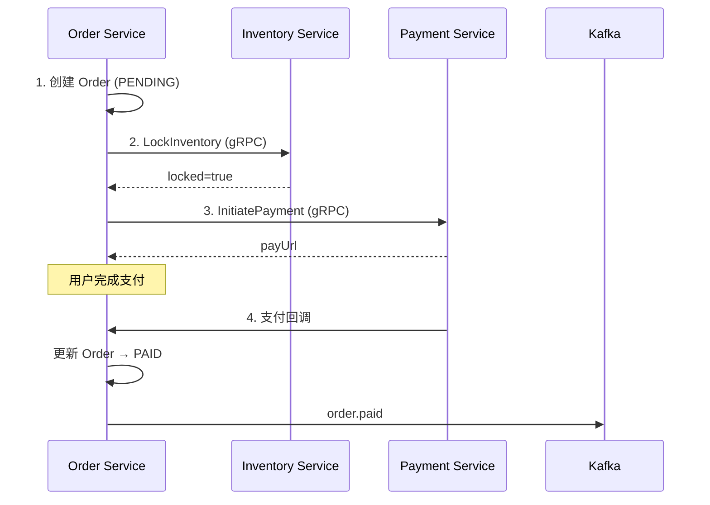
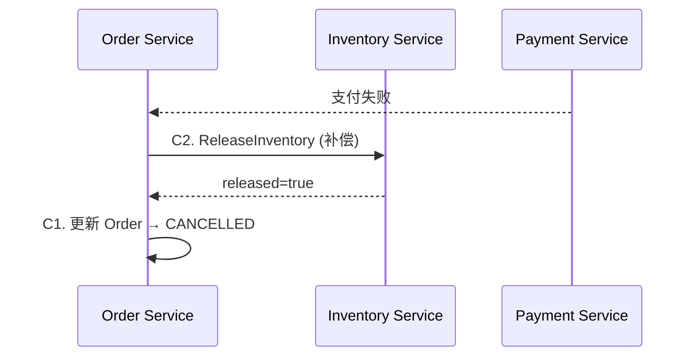
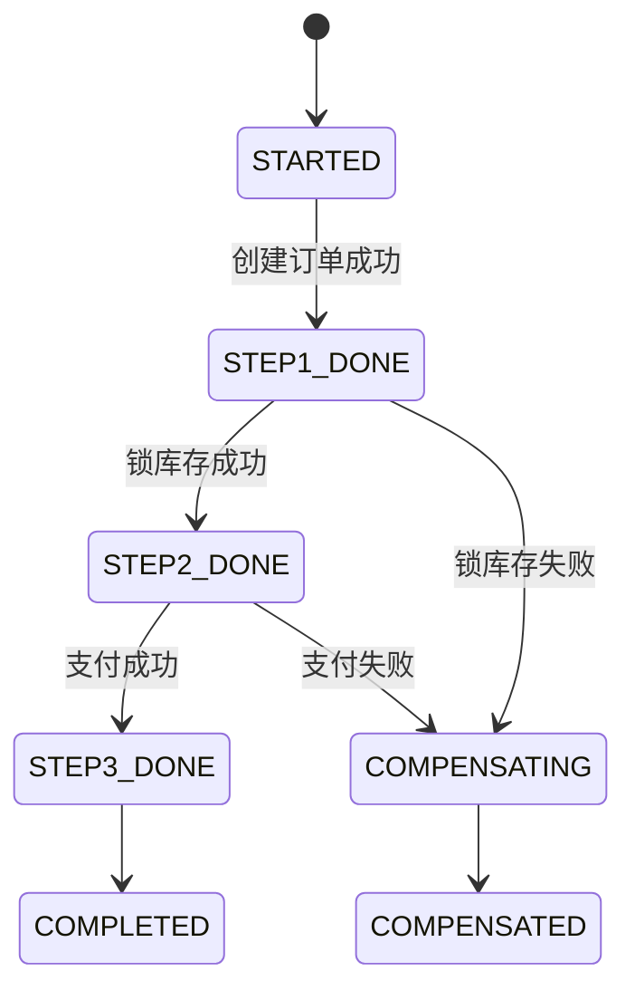

## 为什么不用 2PC

<CardGroup cols={2}>
  <Card title="性能差" icon="gauge" color="#ef4444">
    两阶段锁定期间，所有参与者资源被占用，高并发下吞吐量骤降
  </Card>
  <Card title="协调者单点" icon="triangle-exclamation" color="#ef4444">
    协调者宕机导致所有参与者无限等待，系统不可用
  </Card>
  <Card title="网络放大" icon="network-wired" color="#ef4444">
    跨网络的分布式锁会将单次网络延迟放大 2-4 倍
  </Card>
  <Card title="强一致代价高" icon="lock" color="#ef4444">
    电商场景可以接受最终一致，付出 2PC 的强一致代价不合算
  </Card>
</CardGroup>

---

## Saga 编排模式

**Order Service** 作为 Saga 协调者，顺序调用各步骤：



**补偿流程（支付失败）**：



---

## Saga 状态机



---

## Saga 状态日志

每个步骤执行前记录日志，支持从中断点恢复：

```sql
CREATE TABLE saga_log (
    id          BIGINT PRIMARY KEY,
    saga_id     VARCHAR(64) NOT NULL,  -- 与 orderId 关联
    step        TINYINT NOT NULL,      -- 1=创建订单, 2=锁库存, 3=支付
    action      ENUM('FORWARD', 'COMPENSATE'),
    status      ENUM('STARTED', 'DONE', 'FAILED'),
    payload     JSON,
    created_at  DATETIME DEFAULT NOW()
);
```

**重启恢复逻辑**：

```python
def resume_saga(saga_id: str):
    logs = saga_log.get_by_saga_id(saga_id)
    last_done_step = max(l.step for l in logs if l.status == 'DONE')

    if last_done_step == 1:
        return execute_step_2(saga_id)
    elif last_done_step == 2:
        return execute_step_3(saga_id)
```

<Note>
  Saga 日志保证幂等：已完成（`DONE`）的步骤不会重复执行，即使服务重启也能从正确位置继续。
</Note>

---

## 补偿事务清单

| 正向步骤 | 补偿事务 | 幂等保证 |
|----------|----------|----------|
| 创建 Order | 更新 Order 为 CANCELLED | CANCELLED 是终态，重复设置无害 |
| 锁定库存 | 释放库存（+N） | `lock_id` 唯一键，防重复释放 |
| 发起支付 | 申请退款（若已扣款） | `refund_request_id` 唯一键 |

---

## 最终一致性保证

<AccordionGroup>
  <Accordion title="支付成功但 Order 未更新怎么办？" icon="question">
    Payment Service 通过 **Outbox Pattern** 发布事务消息到 Kafka。Relay Worker 持续投递，直到 Order Service 消费成功并 commit offset。

    最坏情况：用户看到订单还是 PENDING，但 3-10 秒后 Kafka 重试后自动修正为 PAID。
  </Accordion>
  <Accordion title="补偿失败怎么办？" icon="question">
    补偿也遵循重试策略（指数退避，最多 5 次）。超过重试次数后进入 **人工处理队列**，运营人员介入处理。

    同时触发告警（飞书机器人）：`Saga 补偿失败 | sagaId=xxx | 步骤=释放库存`
  </Accordion>
  <Accordion title="库存释放后是否会被其他人抢走？" icon="question">
    是的，这是设计如此。补偿流程是：先释放库存（归还给资源池），再取消订单。这保证了库存资源不会永久占用。

    用户体验：展示"订单已取消，如需购买请重新下单"。
  </Accordion>
</AccordionGroup>
